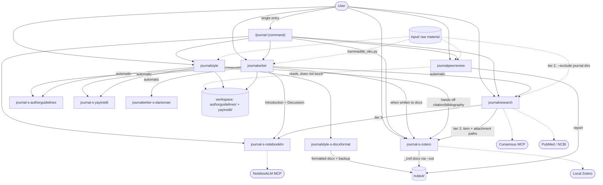

# journal plugin — CLAUDE.md (living architecture reference)

> ## ⚠️ MAINTENANCE RULE (read first)
> **This is a LIVING document.** When a **skill / agent / reference / script / function** is
> **added to, changed in, or removed from the plugin, this file is updated with the SAME change.**
> Whichever component a change affects, the relevant table/section is updated by hand; if a new
> component is added, a row is added to the inventory, and if one is removed, the row is deleted.
> Goal: let the user track the plugin's current state from a single file.
>
> **Four routing surfaces move together — updating this file alone is not enough.** A component
> change must land in all of them in the same edit: (1) this file's §3 trigger table, §5 agent
> table, §6 map, §7 ownership and §10 inventory; (2) the root **`README.md`** contents table and
> its "N skills + N agents" heading; (3) **`commands/journal.md`** §2 intent table; (4)
> **`.claude-plugin/plugin.json`**. The 1.6.0 audit found the README and the command left behind —
> the rule now names them explicitly so the omission cannot repeat.
>
> _History of every change: `docs/CHANGELOG.md` (oldest first). Append new entries there._

---

## 1. Overview

The `journal` plugin (marketplace: `plugin-journal`) is a Claude Code plugin that runs an
academic/medical manuscript along the **write → find sources → generate bibliography → format for
the journal → critique as a reviewer** pipeline. Documentation bodies are in English; the skill and
agent `description` fields stay Turkish so they trigger on the user's own phrasing (`journalresearch` and
`journal-s-notebooklm` are the English ones). It hosts **1 command + 4 skills + 6 agents**; it defines
no hooks/MCP servers (it only *consumes* external MCP servers — NotebookLM, Consensus, PubMed).

Manifests:
- `.claude-plugin/plugin.json` — `name: journal`, and the **single place a version is written**
  (the minor is set by hand per the log above; the **patch digit belongs to the sync hook**, which
  bumps it on every reconcile and, since 2026-07-27, commits and pushes that one line itself — do not
  pin the number here, it goes stale within the session). **Current state, 2026-09-06: that hook is
  not installed on this machine** — `~/.claude/hooks/` holds no `sync-yerel-global*.js` and
  `settings.json` registers none — so the patch bump, the commit and the push are **manual** until it
  is reinstalled. The marketplace entry points at **GitHub** (`onurdavutdag/plugin-journal`), not at
  this folder: an edit here reaches the installed plugin only after commit → push → `claude plugin
  update journal@plugin-journal`. **No `SKILL.md` carries a `version:`
  field**: a hand-aligned copy always lagged the hook's automatic bump by one patch, nothing reads
  the field, and the spec requires only `name` + `description`. Rule source:
  `klasoredit:klasoreditplugin` → `references/senkron-kurali.md`. The manifest also lists 1 command +
  4 skills + 6 agents, plus `repository`, `license: SEE LICENSE IN LICENSE.txt` (personal use — see the root
  `LICENSE.txt`) and `keywords`. Its `description` states the **team** scope (write · find sources ·
  cite · format · review) plus the single entry point (`/journal`), and must stay in step with
  `marketplace.json`.
- **Machine-level environment (two variables, both persistent user scope):** `ZOTERO_DATA_DIR` (the
  shared Zotero library) and, since 1.17.0, `JOURNAL_PLUGIN_HOME` (the checkout holding `input/` +
  `output/`, §2). Both need a Claude Code process started after they were set.
- `.claude-plugin/marketplace.json` — `name: plugin-journal`; single plugin (`source: "."`).
  The marketplace name, the local source folder and the GitHub repository all read `plugin-journal`;
  the plugin id stays `journal`, so the install id is `journal@plugin-journal`.

---

## 2. Workspace model (WORKING folder) — `input/` + `output/` at the checkout root, or the docx's folder

Since 1.17.0 the plugin has two workspace shapes; `journalstyle_calismaklasoru.py` picks one and
reports it as `mode`. Callers use only the JSON keys, never a literal folder name.

**`plugin-home` (default for the user's own work).** The raw material sits in the plugin
**checkout's** `input/` folder; the checkout root is the workspace and every result goes to `output/`:

```
<plugin-journal checkout = JOURNAL_PLUGIN_HOME>/
  input/                                     raw material (placed by the user; git-ignored)
    <thesis or draft>.docx · <results>.xlsx/.csv · <slides>.pptx · *.pdf · *.md/.txt
    yayinstili/<slug>/*.pdf                  sample article PDFs from the journal (style analysis)
    yayinstili/<slug>.yayinstili.json        actual publication style (produced by the plugin)
    authorguidelines/<slug>/*.pdf            the journal's author guidelines PDF
    authorguidelines/<slug>.json             official rule profile (produced by the plugin)
  output/                                    everything the plugin produces (git-ignored):
    <manuscript>_<slug>.docx · <manuscript>_original_backup.docx · <ad>_zref.docx · <report> YYYYMMDD HHMM.md
```

**`docx-folder` (1.16 behaviour, unchanged).** A source `.docx` anywhere else makes its own folder
the workspace:

```
<workspace = source .docx folder>/
  <manuscript>.docx                          source (placed by the user)
  yayinstili/<slug>/*.pdf                    sample article PDFs from the journal (style analysis)
  yayinstili/<slug>.yayinstili.json          actual publication style (produced by the plugin)
  authorguidelines/<slug>/*.pdf              the journal's author guidelines PDF
  authorguidelines/<slug>.json               official rule profile (produced by the plugin)
  ciktilar/<manuscript>_<slug>.docx          formatted output
  README.md                                  scaffold placeholder
```

**Why the checkout must be resolved at run time.** The marketplace source is GitHub and `input/` +
`output/` are git-ignored, so the installed copy (`~/.claude/plugins/cache/plugin-journal/journal/<v>/`,
= `${CLAUDE_PLUGIN_ROOT}`) never contains them. `scripts/hammadde_kokcoz.py` (plugin root, owned by no
skill) finds the checkout — the first candidate with an `input/` directory wins:

| # | candidate | condition |
|---|---|---|
| 1 | env `JOURNAL_PLUGIN_HOME` | persistent user variable, set once per machine (reaches only a process started after it) |
| 2 | cwd | only if `<cwd>/.claude-plugin/plugin.json` has `"name": "journal"` |
| 3 | `CLAUDE_PLUGIN_ROOT`, else this script's grandparent | the installed copy — qualifies only in a dev checkout |

No hit → `{"error": "no_input_root", "candidates": [...]}` and **exit 2** (the `no_zotero` contract);
the skills then say to set `JOURNAL_PLUGIN_HOME` and fall back to asking for a path — nothing is
scaffolded blindly, and `input/` itself is never created (its presence *is* the checkout signal).
Scaffold: `output/`, `input/yayinstili/`, `input/authorguidelines/`.

**S8 reports BILGI here.** Since klasoredit 1.8.9 the validator reads the marketplace source: this one is
GitHub-sourced, so git-ignored `input/`/`output/` never reach an installed copy and S8 reports them as
BILGI (not UYARI). A *tracked* PDF or folder in the shipped tree would still be a real S8 UYARI.

**Raw-material reader.** `scripts/hammadde_oku.py` (plugin root): `--list` inventories `input/`
(excluding the two journal subfolders and `~$*` locks; reports which backend each type has);
`"<file>"` returns `{type, backend, ok, summary, text, total_chars, truncated, warnings}` for
docx/pdf/pptx/xlsx/csv/md/txt — `--outline` (headings / slide titles / sheet names), `--heading X`
(one docx section or one slide), `--sheet N` + `--max-rows`, `--pages a-b`, `--full`/`--max-chars`
(1500 / 20000 defaults as in `journalstyle_pdfmetincikar.py`). Dependency-free fallbacks: zip/XML
for docx/pptx/xlsx (python-docx, python-pptx, openpyxl preferred when installed); PDF through the
same fitz → pypdf → PyPDF2 → pdfplumber chain, else `no_pdf_extractor` → Read tool. A thesis with
no heading style gets headings inferred from bold/uppercase lines and their `5.1.2` numbering
(`headings_inferred` in the summary). It never computes the structural metrics
`journalstyle_docxyapicikar.py` owns. Corrupt file → `ok:false, error:"unreadable"`, exit 0.

**Each profile sits beside the source it came from** — there is no separate profile folder. The rule
profile is measured from the guideline PDFs + web, so it lives in `authorguidelines/`; the de-facto
style is measured from the sample articles, so it lives in `yayinstili/`. Callers build the path from
the `authorguidelines_dir` / `yayinstili_dir` keys of the `journalstyle_calismaklasoru.py` JSON; there is no
`profiles_dir` key (removed at 1.16.0 together with the `-pdf` folder-name suffixes).

- **Resolution + scaffold:** `skills/journalstyle/scripts/journalstyle_calismaklasoru.py`. Detects the
  mode (a target under `<home>/input/` — or a bare file name that exists there — → `plugin-home`),
  derives the workspace, **auto-creates** the missing subfolders (+ README in docx-folder mode only;
  idempotent), and prints a JSON path report with `mode`, `home`, `sources_dir`, `outputs_dir`, the
  `*_dir` / `*_slug_dir` keys and the PDF lists. It imports `hammadde_kokcoz` from the plugin root
  through a guarded import, so a 1.16 cache copy without that file still runs in docx-folder mode.
  `<slug>` e.g.: The Spine Journal → `thespinejournal`.
- **Falls back to the web if empty:** if `yayinstili/<slug>/` or `authorguidelines/<slug>/`
  is empty, the relevant agent falls back to the web (content is still produced).
- **Pre-1.16.0 workspaces:** a workspace still carrying `yayinstili-pdf/`, `authorguidelines-pdf/` or
  `journal-profiles/` is reported in the script's JSON as **`legacy_dirs`** and warned about on stderr.
  In plugin-home mode a root-level `ciktilar/`, `yayinstili/` or `authorguidelines/` (a docx once sat
  at the root) is reported the same way. Nothing is moved automatically (content-loss risk) — the
  skill tells the user what to move.
- **Resource paths (scripts AND references):** every plugin resource whose path crosses a component
  boundary is addressed as `${CLAUDE_PLUGIN_ROOT:-$(pwd)}/skills/<skill>/{scripts,references}/...` (in a
  global install cwd = workspace, so a bare `scripts/...`, `references/...` or `../<other-skill>/...`
  path does not resolve). This covers:
  - **every script call** — the skills' own `skills/<skill>/scripts/…` and the plugin-root
    `scripts/zotero_{cite,lib}.py` alike;
  - **every agent → reference/script path** — an agent file lives outside any skill directory, so it has
    no anchor at all and MUST use the prefix;
  - **every cross-component reference** — e.g. journalwriter/journalresearch pointing at the plugin-root
    `references/zotero-r-…`, journalpeerreview pointing at `skills/journalwriter/references/…`.

  **Plugin-root `references/` and `scripts/`** hold what no skill owns: the three zotero scripts
  (`zotero_{docxatifbas,kutuphaneoku,kutuphaneyaz}.py`), the two raw-material scripts
  (`hammadde_{kokcoz,oku}.py`, 1.17.0) and **7** reference files (6 `zotero-r-*` + `notebooklm-r-rehber.md`
  — the count fell from 12 when the teacher agent's six teaching references went at 1.9.0). They are
  addressed the same way —
  `${CLAUDE_PLUGIN_ROOT:-$(pwd)}/{references,scripts}/…` — never bare.

  The single intentional exception: a skill naming **its own** bundled resource (`references/foo.md`
  inside its own SKILL.md), where the skill directory is the anchor.

---

## 3. Quick trigger table (which phrase opens which skill)

Every skill still triggers on its own phrasing. **If you do not know which one you need, type
`/journal <your request>`** — the command picks the owner for you (see §3.5).

| What you say (trigger) | Skill opened | What you must state (required) |
|---|---|---|
| `/journal <request>`, or `/journal` alone | **the command** — routes to the right skill/agent | nothing up front; it asks for what is missing |
| "… **write**", "write intro/discussion/abstract", "create manuscript text", "write this section in [journal] style" | **journalwriter** | target journal + article type + source file + language + *(which section; if none, all)* |
| "**format** for …", "prepare for submission", "match the journal template", "arrange per author guidelines" | **journalstyle** | `.docx` + target journal name *(+ article type)* |
| "**find sources**", "verify/add references", "search PubMed", "Consensus", "search my PDFs", "support this claim" | **journalresearch** | claim/sentence or topic *(journalwriter triggers this automatically)* |
| "add to my library", "add by DOI/PMID", "write bibliography into Word", "change citation style" — a FILE is processed | **`journal-s-zotero`** *(agent)* | `.docx` + *(to add)* DOI/PMID **or** the desired citation style |
| "do a **peer review**", "critique from a reviewer's view", "critique before submission", "is it ready to publish" | **journalpeerreview** | manuscript (`.docx`/`.pdf`/`.md`) + *(opt.)* journal + study type |
| "do **analysis**", "t-test", "ANOVA", "correlation", "regression", "statistics professor" | *istatistik-profesoru* *(outside the plugin, global skill)* | dataset |

---

## 3.5 Command inventory — `/journal` (the single entry point)

**File:** `commands/journal.md` · **Frontmatter:** `description` (Turkish, shown in `/help`) +
`argument-hint` (**quoted** — an unquoted value starting with `[` is YAML flow-sequence syntax and
parses as a list). The body is written as instructions **to Claude**, per
`plugin-dev:command-development`. The command appears namespaced as **`/journal:journal`** (plugin
`journal` + command `journal`), alongside the skills' `/journal:journalwriter`, `/journal:journalresearch`, …

- **Purpose:** the user describes the job in one line; the command works out **who owns it**, collects
  that owner's required information and hands over. It is a router — it writes no text, formats no
  file, prints no citation, produces no review.
- **Why a command, not a skill:** a router skill would auto-trigger on the same sentences as the
  specialist skills and add a needless hop. A command fires only when typed, so the existing
  natural-language triggers keep working unchanged.
- **With no argument:** asks with `AskUserQuestion` — write a section · find/verify sources · citations
  + bibliography into Word · format for the journal (peer review, NotebookLM and the full
  pipeline are reached through the free-text "Other" answer, since the tool allows 4 options).
- **Routing:** the intent table in the command mirrors §3 and §7 and must be updated whenever those
  change. It also routes statistics requests **out** of the plugin to the global `istatistik-profesoru`.
- **Full pipeline mode** ("baştan sona hazırla"): runs the §7 submission-ready order
  journalwriter → journal-s-zotero → journalstyle → journalpeerreview, **asking for approval between steps** — never silently.
- **Limits:** does not call sub-agents on the user's behalf (the skills call their own). Two
  exceptions §5 lists as directly callable: `journal-s-notebooklm` and `journal-s-zotero` — the
  latter because since 1.7.0 it has no owning skill, so the command reaches it directly. The §9
  red lines apply.

---

## 4. Skill inventory (detail)

### 4.1 journalstyle — mechanical formatting for the journal
- **Purpose:** converts the source `.docx` into a `.docx` that conforms to the target journal's
  author guidelines (font, size, line spacing, margins, page size, section-order check). **Does NOT
  touch citations/bibliography** (that is `journal-s-zotero`'s job).
- **Missing required section:** Step 3 names them and asks; on approval Step 4's agent adds each one
  as an empty Word heading at the **end** of the file (`journalstyle_docxbicimuygula.py --add-sections`). Section
  order is never rearranged automatically — content-loss risk.
- **Flow:** (0) resolve workspace + scaffold with `journalstyle_calismaklasoru.py` → (2) get the official profile
  (`<slug>.json`) → **authorguidelines web+PDF checkpoint** → (2.5) publication style
  (`<slug>.yayinstili.json`) → (3) source structure analysis → (4) apply format with `docxformat`,
  output + backup to `<outputs_dir>` (`output/` in plugin-home mode, `ciktilar/` otherwise) → (5)
  verify + report. Step 0a (1.17.0): no file named → `scripts/hammadde_oku.py --list` offers the
  `input/` docx entries.
- **Agents it calls:** `journal-s-authorguidelines`, `journal-s-yayinstili`,
  `journalstyle-s-docxformat`.
- **Reference:** `journalstyle-r-authorguidelines.md` (official rule schema),
  `journalstyle-r-yayinstili.md` (actual style schema).
- **Scripts:** `journalstyle_calismaklasoru.py`, `journalstyle_docxbicimuygula.py`, `journalstyle_docxyapicikar.py`, `journalstyle_pdfmetincikar.py`,
  `journalstyle_docxgorunmeyenigorur.py` (shared helper: paragraph walk covering tables/headers/footers, inline+anchored
  drawing count, utf-8 stdout — imported by the other journalstyle scripts only; `zotero_docxatifbas.py`
  keeps its own copy so the plugin-root zotero scripts depend on no skill).
- **Template/example:** `references/journal-profiles/_example-mdpi.json` (the only file kept there —
  live profiles belong to the workspace). **No PDF is kept in the plugin's shipped tree.** Sample
  article and author-guideline PDFs live in the workspace (`yayinstili/<slug>/`,
  `authorguidelines/<slug>/` next to the source `.docx`, or under the checkout's git-ignored
  `input/` in plugin-home mode); the old local copies were moved out to
  `Desktop\claude working\output\journal-pdf-arsiv\`. `.gitignore` keeps `*.pdf`, `*.docx`, `*.pptx`,
  `*.xlsx`, `input/` and `output/` out of git, and because the marketplace source is GitHub nothing
  git ignores reaches an installed copy — `klasoredit:klasoreditplugin` **S8** reports it as BILGI (§2);
  a PDF in the *shipped* tree would still be a real S8 finding.

### 4.2 journalwriter — section writing in journal style
- **Purpose:** writes a manuscript section (Introduction/Methods/Results/Discussion/Abstract/
  Conclusion) in the target journal's style and the user's voice. The only skill that writes text.
- **What it calls automatically (the user does not call these separately):**
  1. `journal-s-authorguidelines` — *conditional:* produces the profile if none exists (web+PDF checkpoint).
  2. `journal-s-yayinstili` — *conditional:* actual publication style, only when
     `<slug>.yayinstili.json` is missing or stale. Writing several sections of one manuscript does not
     re-analyze the same journal.
  3. `journalwriter-s-danisman` — section skeleton + reporting guideline (STROBE/CONSORT…).
  4. `journalresearch` (skill) — a real DOI/PMID for every scientific sentence lacking a citation. No fabrication.
  5. `journal-s-zotero` (agent) — the two-call contract, both calls scoped to the **manuscript**, not
     the section: (1) key resolution, whose `{source → ITEMKEY}` map is held for the whole manuscript
     and extended by a delta call only when a later section brings new sources — an empty delta means
     no call at all; (2) the docx render, run **once**, when the docx is final (see journalwriter §6
     for why a per-section render leaves the bibliography at `bibliography_count: 0`).
  6. `journal-s-notebooklm` — NotebookLM literature material when writing the **Introduction**
     (background/gap: what is known, where the studies disagree, what is unstudied) and the
     **Discussion** (comparison: supporting/contradicting studies). journalwriter passes a brief; the agent
     calls the MCP tools. Content only — never a citation.
- **Reference:** `journalwriter-s-danisman-r-bilgi.md`, `journalwriter-s-danisman-r-guidelines/`
  (ARRIVE/CARE/CONSORT/PRISMA/STARD/STROBE item level).
- **Note:** journalwriter only writes a `{{zref:ITEMKEY}}` marker; `journal-s-zotero` applies the citation/bibliography.
- **Raw material (1.17.0):** thesis/draft docx, results xlsx/csv, slides pptx, PDFs, md/txt from the
  checkout's `input/`, read through the plugin-root `scripts/hammadde_oku.py` (`--outline` →
  `--heading` for a thesis, `--sheet` for a workbook); every number in the text comes from a row/cell
  the reader returned. Any docx it produces, and the zotero render (`outputs_dir` passed to the agent),
  land in `output/`.

### 4.3 journalresearch — finding real, verifiable sources
- **Purpose:** finds **real** references (DOI/PMID) that support a scientific/clinical claim;
  **never fabricates**. journalwriter triggers this automatically.
- **Source order (four tiers, strict):** (1) references the **user supplied** → (2) uploaded PDFs —
  the fixed `pdflerim/` library always, plus the checkout's `input/` (resolved with
  `hammadde_kokcoz.py`, searched with `--exclude yayinstili authorguidelines`; `no_input_root` → skip
  silently), plus the workspace, plus a named Zotero collection **through
  `journal-s-zotero`** (the agent returns items + attachment paths; the skill reads the files and
  never queries the library itself) → (3) NotebookLM **via `journal-s-notebooklm`**, not by calling
  the MCP tools itself → (4) Consensus / PubMed (MCP; if no MCP, auth-free NCBI E-utilities via
  `journalresearch_pubmedara.py`).
- **Reference:** `journalresearch-r-consensus.md`, `journalresearch-r-kunye.md`, `journalresearch-r-pdf.md`.
- **Scripts:** `journalresearch_pdfara.py`, `journalresearch_pubmedara.py`.
- **Local PDF pool:** `pdflerim/` (git-ignored contents) with its own `README.md` describing the search call.

### 4.4 journalpeerreview — critical pre-submission reviewer
- **Purpose:** critiques the manuscript from a reviewer's view; **does not touch the file** (produces
  a read-only report, written to `<outputs_dir>` — `output/` in plugin-home mode — as
  `<name> YYYYMMDD HHMM.md`; slide text via `hammadde_oku.py`, visuals still need PNG/JPG).
- **Calibration:** reads the `authorguidelines/<slug>.json` + `yayinstili/<slug>.yayinstili.json`
  profiles in the workspace (resolves them with journalstyle_calismaklasoru.py); if none, evaluates by
  general standards and states so in the report.
- **Reference:** `journalpeerreview-r-common-issues.md`. It also **reuses (without touching)** journalwriter's
  reporting-guideline references and the workspace profiles.

---

## 5. Agent inventory (detail)

| Agent | Color · Tools | Caller | Task / output |
|---|---|---|---|
| **journal-s-authorguidelines** | blue · WebSearch, WebFetch, Read | journalstyle, journalwriter | Extracts the official author guidelines. **Web search ALWAYS**; if a PDF exists in the workspace, it also reads from it **separately**. It does **NOT MERGE** the two findings — returns `web_findings` + `pdf_findings` + a short `webpdf_ozet`. **No `Write`**: the skill writes the final `<authorguidelines_dir>/<slug>.json` after the user's checkpoint. Flow: `journalstyle-r-authorguidelines.md` → "Call procedure (checkpoint)". |
| **journal-s-yayinstili** | magenta · WebSearch, WebFetch, Read, Write, Bash | journalstyle, journalwriter | Extracts the journal's **actual publication conventions** (table/figure count, caption, reference count, tense/voice, citation density). Primary source is the workspace `yayinstili/<slug>/` PDFs (`journalstyle_pdfmetincikar.py`); if none, the web. **Writes its own** `<yayinstili_dir>/<slug>.yayinstili.json` (no user decision gates it) and returns the style summary defined in its "Output Format", not the raw JSON. Called **only when that file is missing or stale** — the callers check the cache first. Does not touch the text. Flow: `journalstyle-r-yayinstili.md` → "Call procedure". |
| **journalstyle-s-docxformat** | green · Bash, Read | journalstyle | Applies mechanical formatting (font/size/spacing/margins/page) with `journalstyle_docxbicimuygula.py`; checks section order/missing sections. **Every document change goes through the script** — it carries no `Write`/`Edit` (a `.docx` is a zip; writing it as text corrupts it). With the user's approval it re-runs the script with **`--add-sections`**, which appends each missing `required_sections` entry as a real Word `Heading 1` + placeholder at the end of the file. Section **order** is only reported, never rearranged (1.14.0). |
| **journalwriter-s-danisman** | yellow · Read, Grep, Glob | journalwriter | The section's IMRaD skeleton + the reporting guideline suited to the study type (STROBE/CONSORT/STARD/CARE/PRISMA) + common mistakes, in the four parts its **"Output Format"** declares (plus a critique block when a draft was passed). **Does not produce citations.** |
| **journal-s-notebooklm** | cyan · Read + 26 `mcp__notebooklm-mcp__*` tools | journalwriter, journalresearch, the user directly | **Sole owner of NotebookLM interaction.** Advisor + operator: picks the tool/persona/prompt from `references/notebooklm-r-rehber.md`, then runs it (query, studio outputs, Deep Research, source curation). Returns findings + `Claims to verify` + warnings. **Produces no citations**; writes to the user's account only after explicit approval; has **no** `notebook_delete`/`studio_delete`. Callers follow `notebooklm-r-rehber.md` → "Call procedure". |
| **journal-s-zotero** | red · Read, Glob, Grep, Bash | journalwriter, journalstyle, journalpeerreview, journalresearch, `/journal` | **Owns every touch of the real Zotero library.** sqlite read (works with Zotero closed) + local API write; the docx in-text citation + bibliography, style conversion and pinning. Two-call contract with journalwriter: (1) source list → `{source → ITEMKEY}` map, (2) docx path (+ `outputs_dir` since 1.17.0 → `--out "<outputs_dir>/<stem>_zref.docx"`) → the `zotero_docxatifbas.py` JSON report whose `output` the caller carries on. Runs in its own context **so a library dump never reaches the conversation**. Fabricates no metadata; never writes to sqlite directly — the write goes through `zotero_kutuphaneyaz.py` (de-duplication + `zotero_closed` handling built in). **Carries no MCP and no web tool**, so identifier verification runs on `journalresearch_pubmedara.py` via Bash; an ISBN, an arXiv id or a DOI absent from PubMed is explicitly **not** its job and goes back to the user or to `journalresearch` (1.12.0). Fifth job since 1.13.0: **evidence paths** — journalresearch names a collection, the agent returns items + `storage/<KEY>` attachment paths and stops there; reading those PDFs is the caller's. |

**Naming (1.8.0):** the prefix states **ownership**, and every agent declares it in a `skills:`
frontmatter array so the claim is machine-checkable. Only **two** agents belong to a single skill and
keep the `<skill>-s-<role>` form: `journalstyle-s-docxformat` (`["journalstyle"]`) and
`journalwriter-s-danisman` (`["journalwriter"]`). The other **four** carry the `journal-s-` plugin
prefix because no single skill owns them — `journal-s-authorguidelines` and `journal-s-yayinstili`
(`["journalstyle", "journalwriter"]`; renamed from `journalstyle-s-*` in 1.8.0 once the second caller
was declared), `journal-s-notebooklm` (`["journalwriter", "journalresearch"]` + direct user calls),
and `journal-s-zotero` (`[]` — no owning skill at all since 1.7.0; the empty array is deliberate,
not an omission).

**Format:** all six agents follow the `plugin-dev:agent-development` spec — `name` + `description`
(trigger conditions + typical triggers + pointer to the body) + `model: inherit` + `skills:` + a
distinct `color` (authorguidelines blue · yayinstili magenta · docxformat green · danisman yellow ·
notebooklm cyan · journal-s-zotero red) + array-form `tools`, and a
body carrying "When to invoke" … "Edge Cases".
Agent `description` fields stay Turkish (except notebooklm) so they trigger on the user's own
phrasing — the spec prescribes the structure, not the language.

**Approval gates live in the caller, not the agent.** No agent holds `AskUserQuestion`, and a subagent
has no channel to the user mid-run; every "ask the user first" in an agent body therefore means
*return the question to the calling skill*, which asks and re-invokes. The wording stays because the
agent must know the action is gated; the mechanism is the return.

**Colours (1.9.0):** 6 agents, 6 distinct colours — the forced collision is gone with the teacher.
`journal-s-zotero` keeps `red` as the only file-mutating agent (the spec's "critical" sense fits).

---

## 6. Interaction map (who calls whom)



**Summary:**
- **`/journal`** is the only entry point that reaches every component; it routes and then steps aside —
  the owning skill does the work.
- **journalwriter** is the most connected skill: journalresearch + 3 journalstyle components + journal-s-zotero +
  `journal-s-notebooklm`.
- **`journal-s-notebooklm`** is the only component that touches the NotebookLM MCP server; journalwriter and
  journalresearch reach it through the agent.
- **journalstyle** calls its 3 sub-agents and hands off citation work to **journal-s-zotero**.
- **journalpeerreview** only **reads** the workspace profiles and touches no file.
- **zotero has no skill** since 1.7.0 and no teaching agent since 1.9.0: `journal-s-zotero` is the
  single zotero component, reading the plugin-root `references/zotero-r-*` pool. Teaching the Zotero
  GUI is out of the plugin's scope — a how-to question has no owner, and `/journal` says so instead
  of routing it.

---

## 7. Single-ownership (who does what)

| Job | Owning skill |
|---|---|
| **Writing** the section text | **journalwriter** *(only writes the `{{zref:ITEMKEY}}` marker)* |
| **Finding/verifying** the real source (DOI/PMID) | **journalresearch** |
| docx **citation + bibliography** (numbering, style), library access | **`journal-s-zotero`** *(agent; sole authority)* |
| **Mechanical format** (font, margins, section order) | **journalstyle** |
| Pre-submission **peer review** | **journalpeerreview** *(does not touch the file)* |
| **NotebookLM interaction** (notebook choice, query, studio outputs, Deep Research, curation) | **journal-s-notebooklm** *(agent; content only, no citations)* |

**Submission-ready order (manual, separate commands):**
`write` (journalwriter) → `write bibliography into Word` (journal-s-zotero) → `format for [journal]` (journalstyle) →
`do a peer review` (journalpeerreview)

The same order runs in one go with **`/journal baştan sona hazırla`** — the command chains the four
steps but stops for the user's approval between each (§3.5).

---

## 8. Author guidelines — web + PDF checkpoint (important behavior)

1. `journal-s-authorguidelines` performs a **web search in every case**.
2. If a PDF exists under `authorguidelines/<slug>/` in the workspace, it also extracts rules from it **separately**.
3. The agent **does not merge** the two findings; it returns `web_findings` + `pdf_findings` + a short `webpdf_ozet`.
4. The skill **shows that summary to the user** and asks: *merge / web only / PDF only / manual*.
5. The **skill** writes the final `<authorguidelines_dir>/<slug>.json` per the user's decision
   (`webpdf_source`: `web` / `user-pdf` / `both-merged`). The agent carries no `Write` tool.

**Single description:** the step-by-step flow (cache check → agent call → checkpoint → write) lives in
`skills/journalstyle/references/journalstyle-r-authorguidelines.md` → "Call procedure (checkpoint)".
`journalstyle` step 2 and `journalwriter` step 2 both point there instead of restating it. Its sibling
`journalstyle-r-yayinstili.md` → "Call procedure" does the same job for `journal-s-yayinstili`, whose
asymmetry is deliberate: **that** agent writes its own file, because measurement has no user decision
to gate.

---

## 9. Red lines (apply to all)
- A non-real source/citation is **never produced** (journalresearch never fabricates).
- docx citation/bibliography is **`journal-s-zotero`'s authority only**.
- Copyright: **no verbatim sentence/caption is copied** from sample article/guideline PDFs; only
  numeric metrics and structure in rule form are extracted.
- An uncertain journal rule is **not fabricated** — it is left `null` and the user is warned.

---

## 10. Component inventory (quick file list — update on change)

| Type | Path |
|---|---|
| Manifest | `.claude-plugin/plugin.json`, `.claude-plugin/marketplace.json` |
| Command | `commands/journal.md` (`/journal` — single entry point / router) |
| Skill | `skills/{journalstyle,journalwriter,journalresearch,journalpeerreview}/SKILL.md` |
| Skill README | `skills/{journalstyle,journalwriter,journalresearch,journalpeerreview}/README.md` |
| Agent | `agents/{journal-s-authorguidelines,journal-s-yayinstili,journalstyle-s-docxformat,journalwriter-s-danisman,journal-s-notebooklm,journal-s-zotero}.md` |
| Plugin-level reference | `references/notebooklm-r-rehber.md` (read by `journal-s-notebooklm`) · `references/zotero-r-{zref-protocol,citation-format,add-methods,styles,storage-bridge,word-flow}.md` (operation, read by `journal-s-zotero`) |
| Skill reference | `skills/journalstyle/references/journalstyle-r-{authorguidelines,yayinstili}.md` · `skills/journalwriter/references/journalwriter-s-danisman-r-bilgi.md` + `journalwriter-s-danisman-r-guidelines/{ARRIVE,CARE,CONSORT,PRISMA,STARD,STROBE}.md` · `skills/journalresearch/references/journalresearch-r-{pdf,consensus,kunye}.md` · `skills/journalpeerreview/references/journalpeerreview-r-common-issues.md` — all on the `<owner>-r-<topic>` pattern |
| journalstyle script | `skills/journalstyle/scripts/journalstyle_{calismaklasoru,docxbicimuygula,docxyapicikar,pdfmetincikar,docxgorunmeyenigorur}.py` |
| journalresearch script | `skills/journalresearch/scripts/journalresearch_{pdfara,pubmedara}.py` |
| Plugin-level script | `scripts/zotero_{docxatifbas,kutuphaneoku,kutuphaneyaz}.py` (owned by no skill — `journal-s-zotero` runs them; one authority each: render · read · write) · `scripts/hammadde_{kokcoz,oku}.py` (owned by no skill — every skill and `/journal` run them; checkout-root resolver · raw-material inventory/reader) |
| Folder README (placeholder/usage note) | `skills/journalresearch/pdflerim/README.md` (local PDF pool + search call) |
| Licence | `LICENSE.txt` (root, plugin-wide — personal use; `plugin.json` points at it) |
| Plugin overview | `README.md` (short intro + install) |
| Architecture guide (this file) | `CLAUDE.md` |
