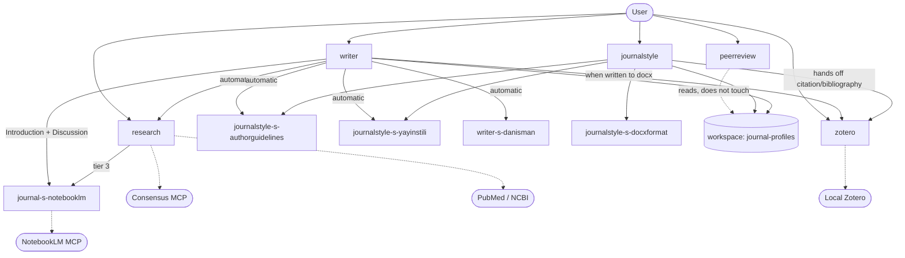

# journal plugin — CLAUDE.md (living architecture reference)

> ## ⚠️ MAINTENANCE RULE (read first)
> **This is a LIVING document.** When a **skill / agent / reference / script / function** is
> **added to, changed in, or removed from the plugin, this file is updated with the SAME change.**
> Whichever component a change affects, the relevant table/section is updated by hand; if a new
> component is added, a row is added to the inventory, and if one is removed, the row is deleted.
> Goal: let the user track the plugin's current state from a single file.
>
> _Last update: 2026-07-25 — full `plugin-dev` spec audit (skill-development · agent-development ·
> plugin-structure): cross-boundary resource paths moved to `${CLAUDE_PLUGIN_ROOT}` (4 agents' knowledge
> paths did not resolve in a global install), all 5 agents given `model`/`color`/array `tools`/"When to
> invoke"/"Edge Cases", all 5 SKILL.md bodies rewritten in imperative form, zotero references renamed to
> `zotero-r-*`, manifest description/metadata corrected; version 1.4.0._
>
> _Last update: 2026-07-25 — rename: the marketplace (`onur-plugins`), the local source folder
> (`journal-plugin`) and the GitHub repository all became **`plugin-journal`**; install id is now
> `journal@plugin-journal`. No component was added or removed; version 1.4.1._
>
> _Last update: 2026-07-25 — validation pass: the licence contradiction resolved (`plugin.json` no longer
> claims MIT; the personal-use `skills/research/LICENSE.txt` moved to a plugin-wide root `LICENSE.txt`),
> `allowed-tools` removed from `peerreview/SKILL.md` so all 5 skills are unrestricted and consistent
> (journalstyle/writer/research need Task + MCP tools, so a restricted list would break them), and the
> section-10 inventory completed with the three previously missing files; version 1.4.2._

---

## 1. Overview

The `journal` plugin (marketplace: `plugin-journal`) is a Claude Code plugin that runs an
academic/medical manuscript along the **write → find sources → generate bibliography → format for
the journal → critique as a reviewer** pipeline. Documentation bodies are in English; the skill and
agent `description` fields stay Turkish so they trigger on the user's own phrasing (`research` and
`journal-s-notebooklm` are the English ones). It hosts **5 skills + 5 agents**; it defines no
commands/hooks/MCP servers (it only *consumes* external MCP servers — NotebookLM, Consensus, PubMed).

Manifests:
- `.claude-plugin/plugin.json` — `name: journal`, `version: 1.4.2`; lists 5 skills + 5 agents, plus
  `repository`, `license: SEE LICENSE IN LICENSE.txt` (personal use — see the root `LICENSE.txt`) and
  `keywords`. Its `description` states the **team** scope (write · find sources · cite · format · review)
  and must stay in step with `marketplace.json`.
- `.claude-plugin/marketplace.json` — `name: plugin-journal`; single plugin (`source: "."`).
  The marketplace name, the local source folder and the GitHub repository all read `plugin-journal`;
  the plugin id stays `journal`, so the install id is `journal@plugin-journal`.

---

## 2. Workspace model (WORKING folder)

The plugin now runs every job through the **folder containing the source `.docx`**. Example PDFs,
the profile cache, and outputs are kept in this folder (not inside the plugin).

```
<workspace = source .docx folder>/
  <manuscript>.docx                          source (placed by the user)
  yayinstili-pdf/<slug>/*.pdf                sample article PDFs from the journal (style analysis)
  authorguidelines-pdf/<slug>/*.pdf          the journal's author guidelines PDF
  journal-profiles/<slug>.json               official rule profile (produced by the plugin)
  journal-profiles/<slug>.yayinstili.json    actual publication style (produced by the plugin)
  ciktilar/<manuscript>_<slug>.docx          formatted output
  README.md                                  scaffold placeholder
```

- **Resolution + scaffold:** `skills/journalstyle/scripts/workspace.py`. Derives the workspace from
  the source `.docx` path, **auto-creates** the missing subfolders + README (idempotent), and prints
  a JSON path report. `<slug>` e.g.: The Spine Journal → `thespinejournal`.
- **Falls back to the web if empty:** if `yayinstili-pdf/<slug>/` or `authorguidelines-pdf/<slug>/`
  is empty, the relevant agent falls back to the web (content is still produced).
- **Resource paths (scripts AND references):** every plugin resource whose path crosses a component
  boundary is addressed as `${CLAUDE_PLUGIN_ROOT:-$(pwd)}/skills/<skill>/{scripts,references}/...` (in a
  global install cwd = workspace, so a bare `scripts/...`, `references/...` or `../<other-skill>/...`
  path does not resolve). This covers:
  - **every script call** — journalstyle, research, zotero alike;
  - **every agent → reference/script path** — an agent file lives outside any skill directory, so it has
    no anchor at all and MUST use the prefix;
  - **every cross-skill reference** — e.g. writer/research pointing at `skills/zotero/references/…`,
    peerreview pointing at `skills/writer/references/…`.

  The single intentional exception: a skill naming **its own** bundled resource (`references/foo.md`
  inside its own SKILL.md), where the skill directory is the anchor.

---

## 3. Quick trigger table (which phrase opens which skill)

| What you say (trigger) | Skill opened | What you must state (required) |
|---|---|---|
| "… **write**", "write intro/discussion/abstract", "create manuscript text", "write this section in [journal] style" | **writer** | target journal + article type + source file + language + *(which section; if none, all)* |
| "**format** for …", "prepare for submission", "match the journal template", "arrange per author guidelines" | **journalstyle** | `.docx` + target journal name *(+ article type)* |
| "**find sources**", "verify/add references", "search PubMed", "Consensus", "search my PDFs", "support this claim" | **research** | claim/sentence or topic *(writer triggers this automatically)* |
| "**zotero**", "add to my library", "add by DOI/PMID", "write bibliography into Word", "change citation style" | **zotero** | `.docx` + *(to add)* DOI/PMID **or** the desired citation style |
| "do a **peer review**", "critique from a reviewer's view", "critique before submission", "is it ready to publish" | **peerreview** | manuscript (`.docx`/`.pdf`/`.md`) + *(opt.)* journal + study type |
| "do **analysis**", "t-test", "ANOVA", "correlation", "regression", "statistics professor" | *istatistik-profesoru* *(outside the plugin, global skill)* | dataset |

---

## 4. Skill inventory (detail)

### 4.1 journalstyle — mechanical formatting for the journal
- **Purpose:** converts the source `.docx` into a `.docx` that conforms to the target journal's
  author guidelines (font, size, line spacing, margins, page size, section-order check). **Does NOT
  touch citations/bibliography** (that is zotero's job).
- **Flow:** (0) resolve workspace + scaffold with `workspace.py` → (2) get the official profile
  (`<slug>.json`) → **authorguidelines web+PDF checkpoint** → (2.5) publication style
  (`<slug>.yayinstili.json`) → (3) source structure analysis → (4) apply format with `docxformat`,
  output to `ciktilar/` → (5) verify + report.
- **Agents it calls:** `journalstyle-s-authorguidelines`, `journalstyle-s-yayinstili`,
  `journalstyle-s-docxformat`.
- **Reference:** `journalstyle-r-authorguidelines.md` (official rule schema),
  `journalstyle-r-yayinstili.md` (actual style schema).
- **Scripts:** `workspace.py`, `apply_profile.py`, `extract_docx_structure.py`, `extract_pdf_text.py`.
- **Template/example:** `references/journal-profiles/_example-mdpi.json` (the only file kept there —
  live profiles belong to the workspace). `references/yayinstili-pdf/`,
  `references/authorguidelines-pdf/` hold local sample PDFs; they are the OLD location (the workspace
  is used now) and are **git-ignored — never committed** (publisher copyright).

### 4.2 writer — section writing in journal style
- **Purpose:** writes a manuscript section (Introduction/Methods/Results/Discussion/Abstract/
  Conclusion) in the target journal's style and the user's voice. The only skill that writes text.
- **What it calls automatically (the user does not call these separately):**
  1. `journalstyle-s-authorguidelines` — *conditional:* produces the profile if none exists (web+PDF checkpoint).
  2. `journalstyle-s-yayinstili` — actual publication style.
  3. `writer-s-danisman` — section skeleton + reporting guideline (STROBE/CONSORT…).
  4. `research` (skill) — a real DOI/PMID for every scientific sentence lacking a citation. No fabrication.
  5. `zotero` (`zotero_cite.py`) — in-text citation + bibliography if written into a docx.
  6. `journal-s-notebooklm` — NotebookLM literature material when writing the **Introduction**
     (background/gap: what is known, where the studies disagree, what is unstudied) and the
     **Discussion** (comparison: supporting/contradicting studies). writer passes a brief; the agent
     calls the MCP tools. Content only — never a citation.
- **Reference:** `writer-s-danisman-r-bilgi.md`, `writer-s-danisman-r-guidelines/`
  (ARRIVE/CARE/CONSORT/PRISMA/STARD/STROBE item level).
- **Note:** writer only writes a `{{zref:ITEMKEY}}` marker; zotero applies the citation/bibliography.

### 4.3 research — finding real, verifiable sources
- **Purpose:** finds **real** references (DOI/PMID) that support a scientific/clinical claim;
  **never fabricates**. writer triggers this automatically.
- **Source order:** local `pdflerim/` → NotebookLM (**via `journal-s-notebooklm`**, not by calling the
  MCP tools itself) → Consensus / PubMed (MCP; if no MCP, auth-free NCBI E-utilities via
  `pubmed_eutils.py`).
- **Reference:** `research-r-consensus.md`, `research-r-kunye.md`, `research-r-pdf.md`.
- **Scripts:** `search_pdfs.py`, `pubmed_eutils.py`.
- **Local PDF pool:** `pdflerim/` (git-ignored contents) with its own `README.md` describing the search call.

### 4.4 zotero — docx citation + bibliography (sole authority)
- **Purpose:** connects to the user's **local Zotero** (`zotero.sqlite` / local API
  `127.0.0.1:23119`); writes in-text citations + bibliography into a docx, and converts the citation
  style. In a docx, citations/bibliography are this skill's authority alone.
- **Reference:** `zotero-r-{add-methods,citation-format,storage-bridge,styles,zref-protocol}.md`
  (renamed to the plugin-wide `<owner>-r-<topic>` pattern).
- **Scripts:** `zotero_cite.py`, `zotero_lib.py`.

### 4.5 peerreview — critical pre-submission reviewer
- **Purpose:** critiques the manuscript from a reviewer's view; **does not touch the file** (produces
  a read-only report).
- **Calibration:** reads the `journal-profiles/<slug>.json` + `<slug>.yayinstili.json` profiles in
  the workspace (resolves them with workspace.py); if none, evaluates by general standards and states
  so in the report.
- **Reference:** `peerreview-r-common-issues.md`. It also **reuses (without touching)** writer's
  reporting-guideline references and the workspace profiles.

---

## 5. Agent inventory (detail)

| Agent | Color · Tools | Caller | Task / output |
|---|---|---|---|
| **journalstyle-s-authorguidelines** | blue · WebSearch, WebFetch, Read, Write | journalstyle, writer | Extracts the official author guidelines. **Web search ALWAYS**; if a PDF exists in the workspace, it also reads from it **separately**. It does **NOT MERGE** the two findings — returns `web_findings` + `pdf_findings` + a short `web_ozet`. The skill writes the final `<slug>.json` after the user's checkpoint. |
| **journalstyle-s-yayinstili** | magenta · WebSearch, WebFetch, Read, Write, Bash | journalstyle, writer | Extracts the journal's **actual publication conventions** (table/figure count, caption, reference count, tense/voice, citation density). Primary source is the workspace `yayinstili-pdf/<slug>/` PDFs (`extract_pdf_text.py`); if none, the web. Writes `<profiles_dir>/<slug>.yayinstili.json`. Does not touch the text. |
| **journalstyle-s-docxformat** | green · Bash, Read, Write, Edit | journalstyle | Applies mechanical formatting (font/size/spacing/margins/page) with `apply_profile.py`; checks section order/missing sections. |
| **writer-s-danisman** | yellow · Read, Grep, Glob | writer | The section's IMRaD skeleton + the reporting guideline suited to the study type (STROBE/CONSORT/STARD/CARE/PRISMA) + common mistakes. **Does not produce citations.** |
| **journal-s-notebooklm** | cyan · Read, Write, Grep, Glob, Bash + 26 `mcp__notebooklm-mcp__*` tools | writer, research, the user directly | **Sole owner of NotebookLM interaction.** Advisor + operator: picks the tool/persona/prompt from `references/notebooklm-r-rehber.md`, then runs it (query, studio outputs, Deep Research, source curation). Returns findings + `Claims to verify` + warnings. **Produces no citations**; writes to the user's account only after explicit approval; has **no** `notebook_delete`/`studio_delete`. |

**Naming:** the `<caller-skill>-s-<role>` convention holds for the first four agents. `journal-s-notebooklm`
serves **two** skills plus direct user calls, so its prefix is the plugin name instead of one skill.

**Format:** all five agents follow the `plugin-dev:agent-development` spec — `name` + `description`
(trigger conditions + typical triggers + pointer to the body) + `model: inherit` + a distinct `color`
(authorguidelines blue · yayinstili magenta · docxformat green · danisman yellow · notebooklm cyan) +
array-form `tools`, and a body carrying "When to invoke" … "Edge Cases". Agent `description` fields stay
Turkish (except notebooklm) so they trigger on the user's own phrasing — the spec prescribes the
structure, not the language.

---

## 6. Interaction map (who calls whom)



**Summary:**
- **writer** is the most connected skill: research + 3 journalstyle components + zotero +
  `journal-s-notebooklm`.
- **`journal-s-notebooklm`** is the only component that touches the NotebookLM MCP server; writer and
  research reach it through the agent.
- **journalstyle** calls its 3 sub-agents and hands off citation work to **zotero**.
- **peerreview** only **reads** the workspace profiles and touches no file.

---

## 7. Single-ownership (who does what)

| Job | Owning skill |
|---|---|
| **Writing** the section text | **writer** *(only writes the `{{zref:ITEMKEY}}` marker)* |
| **Finding/verifying** the real source (DOI/PMID) | **research** |
| docx **citation + bibliography** (numbering, style) | **zotero** *(sole authority)* |
| **Mechanical format** (font, margins, section order) | **journalstyle** |
| Pre-submission **peer review** | **peerreview** *(does not touch the file)* |
| **NotebookLM interaction** (notebook choice, query, studio outputs, Deep Research, curation) | **journal-s-notebooklm** *(agent; content only, no citations)* |

**Submission-ready order (manual, separate commands):**
`write` (writer) → `write bibliography into Word` (zotero) → `format for [journal]` (journalstyle) →
`do a peer review` (peerreview)

---

## 8. Author guidelines — web + PDF checkpoint (important behavior)

1. `journalstyle-s-authorguidelines` performs a **web search in every case**.
2. If a PDF exists under `authorguidelines-pdf/<slug>/` in the workspace, it also extracts rules from it **separately**.
3. The agent **does not merge** the two findings; it returns `web_findings` + `pdf_findings` + a short `web_ozet`.
4. The skill **shows the web summary to the user** and asks: *merge / web only / PDF only / manual*.
5. The **skill** writes the final `<slug>.json` per the user's decision (`guidelines_source`: `web` /
   `user-pdf` / `both-merged`).

---

## 9. Red lines (apply to all)
- A non-real source/citation is **never produced** (research never fabricates).
- docx citation/bibliography is **zotero's authority only**.
- Copyright: **no verbatim sentence/caption is copied** from sample article/guideline PDFs; only
  numeric metrics and structure in rule form are extracted.
- An uncertain journal rule is **not fabricated** — it is left `null` and the user is warned.

---

## 10. Component inventory (quick file list — update on change)

| Type | Path |
|---|---|
| Manifest | `.claude-plugin/plugin.json`, `.claude-plugin/marketplace.json` |
| Skill | `skills/{journalstyle,writer,research,zotero,peerreview}/SKILL.md` |
| Skill README | `skills/{journalstyle,writer,research,zotero,peerreview}/README.md` |
| Agent | `agents/{journalstyle-s-authorguidelines,journalstyle-s-yayinstili,journalstyle-s-docxformat,writer-s-danisman,journal-s-notebooklm}.md` |
| Plugin-level reference | `references/notebooklm-r-rehber.md` (distilled NotebookLM knowledge; read by `journal-s-notebooklm`) |
| Skill reference | `skills/journalstyle/references/journalstyle-r-{authorguidelines,yayinstili}.md` · `skills/writer/references/writer-s-danisman-r-bilgi.md` + `writer-s-danisman-r-guidelines/{ARRIVE,CARE,CONSORT,PRISMA,STARD,STROBE}.md` · `skills/research/references/research-r-{pdf,consensus,kunye}.md` · `skills/zotero/references/zotero-r-{add-methods,citation-format,storage-bridge,styles,zref-protocol}.md` · `skills/peerreview/references/peerreview-r-common-issues.md` — all on the `<owner>-r-<topic>` pattern |
| journalstyle script | `skills/journalstyle/scripts/{workspace,apply_profile,extract_docx_structure,extract_pdf_text}.py` |
| research script | `skills/research/scripts/{search_pdfs,pubmed_eutils}.py` |
| zotero script | `skills/zotero/scripts/{zotero_cite,zotero_lib}.py` |
| Folder README (placeholder/usage note) | `skills/research/pdflerim/README.md` (local PDF pool + search call) · `skills/journalstyle/references/yayinstili-pdf/README.md` (old sample-PDF location; the workspace is used now) |
| Licence | `LICENSE.txt` (root, plugin-wide — personal use; `plugin.json` points at it) |
| Plugin overview | `README.md` (short intro + install) |
| Architecture guide (this file) | `CLAUDE.md` |
