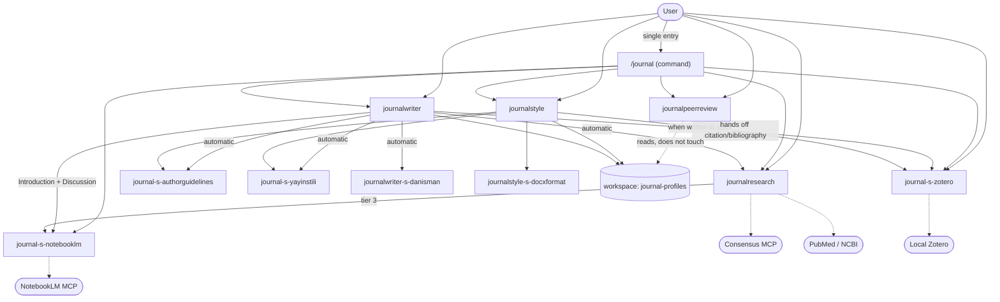

# journal plugin — CLAUDE.md (living architecture reference)

> ## ⚠️ MAINTENANCE RULE (read first)
> **This is a LIVING document.** When a **skill / agent / reference / script / function** is
> **added to, changed in, or removed from the plugin, this file is updated with the SAME change.**
> Whichever component a change affects, the relevant table/section is updated by hand; if a new
> component is added, a row is added to the inventory, and if one is removed, the row is deleted.
> Goal: let the user track the plugin's current state from a single file.
>
> **Four routing surfaces move together — updating this file alone is not enough.** A component
> change must land in all of them in the same edit: (1) this file's §3 trigger table, §5 agent
> table, §6 map, §7 ownership and §10 inventory; (2) the root **`README.md`** contents table and
> its "N skills + N agents" heading; (3) **`commands/journal.md`** §2 intent table; (4)
> **`.claude-plugin/plugin.json`**. The 1.6.0 audit found the README and the command left behind —
> the rule now names them explicitly so the omission cannot repeat.
>
> _Last update: 2026-07-25 — full `plugin-dev` spec audit (skill-development · agent-development ·
> plugin-structure): cross-boundary resource paths moved to `${CLAUDE_PLUGIN_ROOT}` (4 agents' knowledge
> paths did not resolve in a global install), all 5 agents given `model`/`color`/array `tools`/"When to
> invoke"/"Edge Cases", all 5 SKILL.md bodies rewritten in imperative form, zotero references renamed to
> `zotero-r-*`, manifest description/metadata corrected; version 1.4.0._
>
> _Last update: 2026-07-25 — rename: the marketplace (`onur-plugins`), the local source folder
> (`journal-plugin`) and the GitHub repository all became **`plugin-journal`**; install id is now
> `journal@plugin-journal`. No component was added or removed; version 1.4.1._
>
> _Last update: 2026-07-25 — validation pass: the licence contradiction resolved (`plugin.json` no longer
> claims MIT; the personal-use `skills/journalresearch/LICENSE.txt` moved to a plugin-wide root `LICENSE.txt`),
> `allowed-tools` removed from `peerreview/SKILL.md` so all 5 skills are unrestricted and consistent
> (journalstyle/writer/research need Task + MCP tools, so a restricted list would break them), and the
> section-10 inventory completed with the three previously missing files; version 1.4.2._
>
> _Last update: 2026-07-25 — the plugin gained its first **command**: `commands/journal.md` (`/journal`),
> a single entry point that reads the user's request, picks the owning skill/agent and hands the job
> over; with no argument it asks with `AskUserQuestion`. It was made a command rather than a sixth
> (router) skill so that it fires only when typed and does not compete with the 5 skills' own
> natural-language triggers; version 1.5.0. **1.5.1:** `argument-hint` quoted — an unquoted value
> starting with `[` is parsed by YAML as a flow sequence (a list), not the string the loader expects._
>
> _Last update: 2026-07-25 — **script hardening round** (external audit, verified claim by claim).
> `zotero_cite.py`: the source docx is no longer the default output (`<ad>_zref.docx`; an explicit
> `--out` onto the source takes a `.bak`), paragraphs are rewritten run-surgically so italics/bold/
> super-subscript/hyperlinks **and existing `ZOTERO_*` fields** survive, text is read through
> `.//w:r` (hyperlink runs included), old-bibliography deletion is bounded to WJ-tagged paragraphs,
> `unlink --mode field` prints ONE json and saves nothing, markers match case-insensitively.
> `apply_profile.py`: partial `margins_cm`, numeric `line_spacing`, table/header/footer paragraphs,
> warnings for anything not applied; dead `CM_TO_TWIPS` removed. `extract_docx_structure.py`: anchored
> ("wrap text") figures counted. `workspace.py`: warns when the target file does not exist; one shared
> case-insensitive PDF listing reused by `extract_pdf_text.py`, whose `--full` is now capped.
> `pubmed_eutils.py`: `NCBI_EMAIL`/`NCBI_API_KEY` from the environment (the fake `example.invalid`
> address is gone). `zotero_lib.py`: consistent snapshot via `sqlite3.Connection.backup()` + a
> per-PID temp name. New shared helper `skills/journalstyle/scripts/docx_util.py`. All 5 SKILL.md
> `version:` fields aligned with the manifest; version 1.5.2._
>
> _Last update: 2026-07-25 — the plugin gained its **6th agent**, `zotero-s-teacher`, and the `zotero`
> skill became **two-mode**. Distilled from six Zotero video transcripts (Aklan & Salih · Türkel &
> Ateş · Grad Coach · Gömek · Koç ders 11 · Koç & Tekno Akademi) and gap-filled against the NotebookLM
> `zotero` notebook, six Turkish teaching references were added under `skills/zotero/references/`
> (`zotero-r-{kaynak-ekleme,atif-stilleri,eklenti-senkron,ilahiyat,organizasyon,tuzaklar}.md`). The
> agent teaches the GUI workflow only — no `Write`/`Edit`/`Bash`, so docx citation work stays the
> skill's own operational flow (§7 unbroken). It must state the Zotero version behind every step,
> refuse certainty on the ⚠️ items the videos left unclear, and make the user take a backup before
> any data-losing operation. It merged into the existing `zotero` skill rather than becoming a
> separate skill so the two would not compete on the word "zotero"; version 1.6.0._
>
> _Last update: 2026-07-25 — **`control-codebase` audit** (`kod-denetim-raporu 20260725 2207.md`):
> 0 critical, 9 medium, 5 low, all 14 fixed. The 1.6.0 change had left three routing surfaces
> behind (root `README.md` still said "5 agents", `commands/journal.md` and §3 above did not know
> the teaching mode) — fixed, and the maintenance rule now names all four surfaces so the omission
> cannot repeat. Four agents' `description` was **not valid YAML** (an unquoted scalar containing
> `: ` — the same bug class as the 1.5.1 `argument-hint` fix); all now single-quoted, and
> 12/12 frontmatter blocks parse under strict PyYAML. Script fixes: `docx_util.py` gained
> `iter_runs()` (hyperlink runs, which `Paragraph.runs` cannot see) and `to_float()` (Turkish
> decimal comma) — `apply_profile.py` uses both; `extract_pdf_text.py` survives a corrupt PDF;
> `zotero_lib.py` matches short PMIDs and really filters by collection key; `zotero_cite.py` no
> longer inserts a blank paragraph at the top in field mode, no longer writes `[?]` for an unknown
> key, and walks the document in true document order so Vancouver numbering follows first
> appearance; `pubmed_eutils.py` no longer signs third-party queries with the author's address.
> Version 1.6.1._
>
> _Last update: 2026-07-25 — **the `zotero` skill was removed; zotero is now two plugin-level agents.**
> `journal-s-zotero` (operation: sqlite/local-API access + the docx citation/bibliography) and
> `journal-s-zotero-teacher` (renamed from `zotero-s-teacher`). Reason: nothing ever called zotero *as
> a skill* — writer and research ran its scripts directly, so the skill was a wrapper around two
> scripts, 11 references and the single-ownership rule. As an agent the library dump (hundreds of
> records) stays out of the caller's context. The two could not merge into one agent (9,354 + 9,922
> chars against a 10,000 limit), so they stay peers sharing one reference pool. `references/zotero-r-*`
> (11 files + the new `zotero-r-word-flow.md`) and `scripts/zotero_{cite,lib}.py` moved to the **plugin
> root** — the `journal-s-notebooklm` precedent for a component no skill owns. writer now uses a
> **two-call contract**: source list → `{source → ITEMKEY}` map, then docx path → render report.
> No script logic changed. §4.4 deleted, peerreview renumbered 4.4; version 1.7.0._
>
> _Last update: 2026-07-26 — **`klasoredit:klasoreditplugin` naming rule applied retroactively**
> (`plugin-ad-denetle.py`: 3 N4 errors + 7 N6 warnings). Skill names now carry the plugin prefix:
> `writer` → **`journalwriter`**, `research` → **`journalresearch`**, `peerreview` →
> **`journalpeerreview`** (`journalstyle` already conformed); their reference files moved with them
> (`journalresearch-r-*`, `journalpeerreview-r-common-issues.md`, `journalwriter-s-danisman-r-*`).
> Every agent gained a `skills:` array declaring its owner — and once
> `journalstyle-s-authorguidelines` / `journalstyle-s-yayinstili` declared **two** callers
> (journalstyle + journalwriter), the rule ("more than one skill → plugin prefix") renamed them to
> **`journal-s-authorguidelines`** / **`journal-s-yayinstili`**. Housekeeping: `.claude/*.local.md`
> added to `.gitignore` (S6), the plugin-root `output/` folder and the old audit report moved out of
> the tree (S8 — a `.gitignore` entry does not stop `marketplace update` from copying them). The
> maintenance-log entries **above this line keep the pre-1.8.0 names on purpose** — they are history,
> not current state. Version 1.8.0._
>
> _Last update: 2026-07-27 — **`journal-s-zotero-teacher` removed; the plugin is down to 6 agents.**
> The user knows the Zotero GUI and does not need a teacher, so the agent and its six Turkish
> teaching references (`zotero-r-{kaynak-ekleme,atif-stilleri,eklenti-senkron,ilahiyat,organizasyon,
> tuzaklar}.md`, distilled from six video transcripts) were deleted. Safe because the two reference
> pools never overlapped: the operation agent reads only `zotero-r-{word-flow,zref-protocol,
> citation-format,add-methods,styles,storage-bridge}.md`, and its own §2 forbade loading the teaching
> files — so the `journalwriter → journal-s-zotero → journalstyle` citation flow is untouched. The
> agent had `skills: []` and no skill ever called it (user + `/journal` only), so nothing lost a
> callee. Knock-on fixes: directly callable agents are now **two** (notebooklm, zotero), the
> "7 agents / 6 colours" collision paragraph is gone, and `journal-s-notebooklm` is at last the
> **only** component reaching the NotebookLM MCP (the teacher was its single exception). A Zotero
> how-to question now has no owner — `/journal` says so and stops instead of pointing at a component
> that does not exist. The deleted content stays recoverable from git history. Version 1.9.0._
>
> _Last update: 2026-07-27 — **`plugin-dev` spec audit of the two profile agents' skill contracts.**
> Three findings, all fixed. (1) **Least privilege:** `journal-s-authorguidelines` declared `Write`
> but its own body forbade writing the final `<slug>.json` — `Write` removed from `tools`. Its
> sibling `journal-s-yayinstili` keeps `Write` because it genuinely uses it. (2) **Undefined output
> contract:** `journal-s-yayinstili` had no `## Output Format` section — the spec's DON'T list names
> exactly this ("leave output format undefined") — while `journalwriter` §3c consumed "the returned
> style". Added, and the Method's field enumeration (a verbatim restatement of the schema the agent
> already `Read`s) moved to the reference as "What to measure": body 9,738 → 8,681 chars, back under
> the 10,000 limit with room to spare. Method numbering 1·2·2b·**4**·5·6 corrected. (3) **Contradictory
> freshness contract — the behavioral fix:** `journalstyle` 2.5 put the `<slug>.yayinstili.json`
> freshness check in the skill, `journalwriter` §3c delegated it to the agent, and **the agent
> implemented neither** — so writing each section paid a full agent run plus PDF extraction even with
> a warm cache. Both callers now check the cache first and skip the agent entirely when it is fresh.
> Housekeeping against skill-development's anti-duplication rule: the two call procedures now live
> once each in `journalstyle-r-{authorguidelines,yayinstili}.md` ("Call procedure"), and all four
> SKILL.md call sites point there. Version 1.10.0._
>
> _Last update: 2026-07-27 — **dead-reference sweep after the 1.7.0 and 1.9.0 removals.** No behaviour
> was redesigned; six files still named components that no longer exist. `zotero` stopped being a
> **skill** at 1.7.0 (it became the `journal-s-zotero` agent) but was still called one in
> `journalresearch/SKILL.md` — **including its frontmatter `description`**, the text Claude reads when
> routing — in `journalwriter/README.md` (where the call table even typed it `skill`), in
> `references/zotero-r-{zref-protocol,citation-format}.md` (`OWNER: zotero`) and in the root
> `README.md`. The one **runtime** instance: `apply_profile.py` printed *"`zotero` skill'i ile
> uygulanmalı"* to the user at line 135 — it now names the agent. Second class of rot: the `zotero-r-`
> prefix rename left **7 internal pointers** on the pre-rename filenames (`citation-format.md`,
> `add-methods.md`) inside `zotero-r-zref-protocol.md` and `zotero-r-styles.md` — a `Read` on those
> names fails, so the marker protocol could not reach its own format definition. Also fixed:
> `marketplace.json` still advertised "Zotero rehberliği / öğretimi" although the teacher agent went
> at 1.9.0 (`plugin.json` had been updated, the marketplace half of the pair was missed — and it is
> the text shown at install); `commands/journal.md` said "two of the **seven** owners are agents"
> when the §2 table's seventh row points *outside* the plugin, so six is the count; and §5's agent
> table had a stray blank line that split the `journal-s-zotero` row into a separate headerless
> table. The 4 SKILL.md `version:` fields were re-aligned to the manifest (1.8.0 → 1.10.0) — note
> that the sync hook's automatic patch bump reopens a one-patch gap after every commit, so this
> alignment is a manual, recurring act, not a steady state. The changelog entries above keep their
> historical names on purpose._
>
> _Last update: 2026-07-27 — **`plugin-dev` spec audit of the journalwriter team** (the five agents
> journalwriter calls + its own SKILL.md). The 1.10.0 audit had fixed the two *profile* agents; the
> same defect classes were still present in the other three. (1) **Undefined output contract —
> `journalwriter-s-danisman`:** the only one of the five with no output section at all, the spec's
> named DON'T. `journalwriter` §3b had been compensating by restating the four return items. The agent
> now declares `## Output Format` (Skeleton · Content rules · Reporting guideline items · Common
> mistakes, plus a Critique block when a draft was passed, plus the `guideline_items: not in package`
> signal), its Method stopped re-enumerating them, and §3b shrank to a pointer. (2) **Least privilege
> — `journal-s-notebooklm`:** `tools` carried `Write`, `Bash`, `Grep`, `Glob` and the body called
> **none** of them — the artifact tools write their own files, and running `nlm login` is explicitly
> forbidden at line 103, which was the only Bash candidate. Now `["Read", …26 MCP tools]`; §5's tool
> column updated with it. (3) **Anti-duplication:** the NotebookLM call procedure lived in three places
> at once — `journalwriter` §3d (27 lines), `journalresearch` Step 1b (17 lines) and the agent's own
> body. It now lives once, as `notebooklm-r-rehber.md` **§11 "Call procedure"** (same shape and same
> end-of-file position as the two `journalstyle-r-*` precedents), carrying when-to-call, the brief,
> what-comes-back and the two binding rules (content-never-a-citation · silent skip); both callers
> point there. Housekeeping: provenance blocks added to `journalwriter-s-danisman`,
> `journal-s-authorguidelines` and `journal-s-notebooklm`, so all six agents now open a report the same
> way — `journalwriter`'s own provenance block asks which references the subagent read, and until now
> three of them never said. `journal-s-zotero` lost a dead `<!-- Oluşturma -->` comment and an `# Rol:`
> H1 that no sibling carries, and its `## Adım 1/2/3` headings became English like every other agent's.
> `## Return format` / `## Output format` normalised to the spec's `## Output Format`. No behaviour was
> redesigned; §3d, Step 1b and §3b are the same flows, described once instead of twice._

---

## 1. Overview

The `journal` plugin (marketplace: `plugin-journal`) is a Claude Code plugin that runs an
academic/medical manuscript along the **write → find sources → generate bibliography → format for
the journal → critique as a reviewer** pipeline. Documentation bodies are in English; the skill and
agent `description` fields stay Turkish so they trigger on the user's own phrasing (`journalresearch` and
`journal-s-notebooklm` are the English ones). It hosts **1 command + 4 skills + 6 agents**; it defines
no hooks/MCP servers (it only *consumes* external MCP servers — NotebookLM, Consensus, PubMed).

Manifests:
- `.claude-plugin/plugin.json` — `name: journal`, `version: 1.9.x` (the minor is set by hand per the
  log above; the **patch digit belongs to the sync hook**, which bumps it on every reconcile — do not
  pin it here, it goes stale within the session); lists 1 command + 4 skills +
  6 agents, plus `repository`, `license: SEE LICENSE IN LICENSE.txt` (personal use — see the root
  `LICENSE.txt`) and `keywords`. Its `description` states the **team** scope (write · find sources ·
  cite · format · review) plus the single entry point (`/journal`), and must stay in step with
  `marketplace.json`.
- `.claude-plugin/marketplace.json` — `name: plugin-journal`; single plugin (`source: "."`).
  The marketplace name, the local source folder and the GitHub repository all read `plugin-journal`;
  the plugin id stays `journal`, so the install id is `journal@plugin-journal`.

---

## 2. Workspace model (WORKING folder)

The plugin now runs every job through the **folder containing the source `.docx`**. Example PDFs,
the profile cache, and outputs are kept in this folder (not inside the plugin).

```
<workspace = source .docx folder>/
  <manuscript>.docx                          source (placed by the user)
  yayinstili-pdf/<slug>/*.pdf                sample article PDFs from the journal (style analysis)
  authorguidelines-pdf/<slug>/*.pdf          the journal's author guidelines PDF
  journal-profiles/<slug>.json               official rule profile (produced by the plugin)
  journal-profiles/<slug>.yayinstili.json    actual publication style (produced by the plugin)
  ciktilar/<manuscript>_<slug>.docx          formatted output
  README.md                                  scaffold placeholder
```

- **Resolution + scaffold:** `skills/journalstyle/scripts/workspace.py`. Derives the workspace from
  the source `.docx` path, **auto-creates** the missing subfolders + README (idempotent), and prints
  a JSON path report. `<slug>` e.g.: The Spine Journal → `thespinejournal`.
- **Falls back to the web if empty:** if `yayinstili-pdf/<slug>/` or `authorguidelines-pdf/<slug>/`
  is empty, the relevant agent falls back to the web (content is still produced).
- **Resource paths (scripts AND references):** every plugin resource whose path crosses a component
  boundary is addressed as `${CLAUDE_PLUGIN_ROOT:-$(pwd)}/skills/<skill>/{scripts,references}/...` (in a
  global install cwd = workspace, so a bare `scripts/...`, `references/...` or `../<other-skill>/...`
  path does not resolve). This covers:
  - **every script call** — the skills' own `skills/<skill>/scripts/…` and the plugin-root
    `scripts/zotero_{cite,lib}.py` alike;
  - **every agent → reference/script path** — an agent file lives outside any skill directory, so it has
    no anchor at all and MUST use the prefix;
  - **every cross-component reference** — e.g. journalwriter/journalresearch pointing at the plugin-root
    `references/zotero-r-…`, journalpeerreview pointing at `skills/journalwriter/references/…`.

  **Plugin-root `references/` and `scripts/`** hold what no skill owns: the zotero scripts and the 12
  `zotero-r-*`/`notebooklm-r-*` reference files. They are addressed the same way —
  `${CLAUDE_PLUGIN_ROOT:-$(pwd)}/{references,scripts}/…` — never bare.

  The single intentional exception: a skill naming **its own** bundled resource (`references/foo.md`
  inside its own SKILL.md), where the skill directory is the anchor.

---

## 3. Quick trigger table (which phrase opens which skill)

Every skill still triggers on its own phrasing. **If you do not know which one you need, type
`/journal <your request>`** — the command picks the owner for you (see §3.5).

| What you say (trigger) | Skill opened | What you must state (required) |
|---|---|---|
| `/journal <request>`, or `/journal` alone | **the command** — routes to the right skill/agent | nothing up front; it asks for what is missing |
| "… **write**", "write intro/discussion/abstract", "create manuscript text", "write this section in [journal] style" | **journalwriter** | target journal + article type + source file + language + *(which section; if none, all)* |
| "**format** for …", "prepare for submission", "match the journal template", "arrange per author guidelines" | **journalstyle** | `.docx` + target journal name *(+ article type)* |
| "**find sources**", "verify/add references", "search PubMed", "Consensus", "search my PDFs", "support this claim" | **journalresearch** | claim/sentence or topic *(journalwriter triggers this automatically)* |
| "add to my library", "add by DOI/PMID", "write bibliography into Word", "change citation style" — a FILE is processed | **`journal-s-zotero`** *(agent)* | `.docx` + *(to add)* DOI/PMID **or** the desired citation style |
| "do a **peer review**", "critique from a reviewer's view", "critique before submission", "is it ready to publish" | **journalpeerreview** | manuscript (`.docx`/`.pdf`/`.md`) + *(opt.)* journal + study type |
| "do **analysis**", "t-test", "ANOVA", "correlation", "regression", "statistics professor" | *istatistik-profesoru* *(outside the plugin, global skill)* | dataset |

---

## 3.5 Command inventory — `/journal` (the single entry point)

**File:** `commands/journal.md` · **Frontmatter:** `description` (Turkish, shown in `/help`) +
`argument-hint` (**quoted** — an unquoted value starting with `[` is YAML flow-sequence syntax and
parses as a list). The body is written as instructions **to Claude**, per
`plugin-dev:command-development`. The command appears namespaced as **`/journal:journal`** (plugin
`journal` + command `journal`), alongside the skills' `/journal:journalwriter`, `/journal:journalresearch`, …

- **Purpose:** the user describes the job in one line; the command works out **who owns it**, collects
  that owner's required information and hands over. It is a router — it writes no text, formats no
  file, prints no citation, produces no review.
- **Why a command, not a skill:** a router skill would auto-trigger on the same sentences as the
  specialist skills and add a needless hop. A command fires only when typed, so the existing
  natural-language triggers keep working unchanged.
- **With no argument:** asks with `AskUserQuestion` — write a section · find/verify sources · citations
  + bibliography into Word · format for the journal (peer review, NotebookLM and the full
  pipeline are reached through the free-text "Other" answer, since the tool allows 4 options).
- **Routing:** the intent table in the command mirrors §3 and §7 and must be updated whenever those
  change. It also routes statistics requests **out** of the plugin to the global `istatistik-profesoru`.
- **Full pipeline mode** ("baştan sona hazırla"): runs the §7 submission-ready order
  journalwriter → journal-s-zotero → journalstyle → journalpeerreview, **asking for approval between steps** — never silently.
- **Limits:** does not call sub-agents on the user's behalf (the skills call their own). Two
  exceptions §5 lists as directly callable: `journal-s-notebooklm` and `journal-s-zotero` — the
  latter because since 1.7.0 it has no owning skill, so the command reaches it directly. The §9
  red lines apply.

---

## 4. Skill inventory (detail)

### 4.1 journalstyle — mechanical formatting for the journal
- **Purpose:** converts the source `.docx` into a `.docx` that conforms to the target journal's
  author guidelines (font, size, line spacing, margins, page size, section-order check). **Does NOT
  touch citations/bibliography** (that is `journal-s-zotero`'s job).
- **Flow:** (0) resolve workspace + scaffold with `workspace.py` → (2) get the official profile
  (`<slug>.json`) → **authorguidelines web+PDF checkpoint** → (2.5) publication style
  (`<slug>.yayinstili.json`) → (3) source structure analysis → (4) apply format with `docxformat`,
  output to `ciktilar/` → (5) verify + report.
- **Agents it calls:** `journal-s-authorguidelines`, `journal-s-yayinstili`,
  `journalstyle-s-docxformat`.
- **Reference:** `journalstyle-r-authorguidelines.md` (official rule schema),
  `journalstyle-r-yayinstili.md` (actual style schema).
- **Scripts:** `workspace.py`, `apply_profile.py`, `extract_docx_structure.py`, `extract_pdf_text.py`,
  `docx_util.py` (shared helper: paragraph walk covering tables/headers/footers, inline+anchored
  drawing count, utf-8 stdout — imported by the other journalstyle scripts only; `zotero_cite.py`
  keeps its own copy so the plugin-root zotero scripts depend on no skill).
- **Template/example:** `references/journal-profiles/_example-mdpi.json` (the only file kept there —
  live profiles belong to the workspace). `references/yayinstili-pdf/`,
  `references/authorguidelines-pdf/` hold local sample PDFs; they are the OLD location (the workspace
  is used now) and are **git-ignored — never committed** (publisher copyright).

### 4.2 journalwriter — section writing in journal style
- **Purpose:** writes a manuscript section (Introduction/Methods/Results/Discussion/Abstract/
  Conclusion) in the target journal's style and the user's voice. The only skill that writes text.
- **What it calls automatically (the user does not call these separately):**
  1. `journal-s-authorguidelines` — *conditional:* produces the profile if none exists (web+PDF checkpoint).
  2. `journal-s-yayinstili` — *conditional:* actual publication style, only when
     `<slug>.yayinstili.json` is missing or stale. Writing several sections of one manuscript does not
     re-analyze the same journal.
  3. `journalwriter-s-danisman` — section skeleton + reporting guideline (STROBE/CONSORT…).
  4. `journalresearch` (skill) — a real DOI/PMID for every scientific sentence lacking a citation. No fabrication.
  5. `journal-s-zotero` (agent) — the two-call contract: keys first, then the docx render.
  6. `journal-s-notebooklm` — NotebookLM literature material when writing the **Introduction**
     (background/gap: what is known, where the studies disagree, what is unstudied) and the
     **Discussion** (comparison: supporting/contradicting studies). journalwriter passes a brief; the agent
     calls the MCP tools. Content only — never a citation.
- **Reference:** `journalwriter-s-danisman-r-bilgi.md`, `journalwriter-s-danisman-r-guidelines/`
  (ARRIVE/CARE/CONSORT/PRISMA/STARD/STROBE item level).
- **Note:** journalwriter only writes a `{{zref:ITEMKEY}}` marker; `journal-s-zotero` applies the citation/bibliography.

### 4.3 journalresearch — finding real, verifiable sources
- **Purpose:** finds **real** references (DOI/PMID) that support a scientific/clinical claim;
  **never fabricates**. journalwriter triggers this automatically.
- **Source order:** local `pdflerim/` → NotebookLM (**via `journal-s-notebooklm`**, not by calling the
  MCP tools itself) → Consensus / PubMed (MCP; if no MCP, auth-free NCBI E-utilities via
  `pubmed_eutils.py`).
- **Reference:** `journalresearch-r-consensus.md`, `journalresearch-r-kunye.md`, `journalresearch-r-pdf.md`.
- **Scripts:** `search_pdfs.py`, `pubmed_eutils.py`.
- **Local PDF pool:** `pdflerim/` (git-ignored contents) with its own `README.md` describing the search call.

### 4.4 journalpeerreview — critical pre-submission reviewer
- **Purpose:** critiques the manuscript from a reviewer's view; **does not touch the file** (produces
  a read-only report).
- **Calibration:** reads the `journal-profiles/<slug>.json` + `<slug>.yayinstili.json` profiles in
  the workspace (resolves them with workspace.py); if none, evaluates by general standards and states
  so in the report.
- **Reference:** `journalpeerreview-r-common-issues.md`. It also **reuses (without touching)** journalwriter's
  reporting-guideline references and the workspace profiles.

---

## 5. Agent inventory (detail)

| Agent | Color · Tools | Caller | Task / output |
|---|---|---|---|
| **journal-s-authorguidelines** | blue · WebSearch, WebFetch, Read | journalstyle, journalwriter | Extracts the official author guidelines. **Web search ALWAYS**; if a PDF exists in the workspace, it also reads from it **separately**. It does **NOT MERGE** the two findings — returns `web_findings` + `pdf_findings` + a short `web_ozet`. **No `Write`**: the skill writes the final `<slug>.json` after the user's checkpoint. Flow: `journalstyle-r-authorguidelines.md` → "Call procedure (checkpoint)". |
| **journal-s-yayinstili** | magenta · WebSearch, WebFetch, Read, Write, Bash | journalstyle, journalwriter | Extracts the journal's **actual publication conventions** (table/figure count, caption, reference count, tense/voice, citation density). Primary source is the workspace `yayinstili-pdf/<slug>/` PDFs (`extract_pdf_text.py`); if none, the web. **Writes its own** `<profiles_dir>/<slug>.yayinstili.json` (no user decision gates it) and returns the style summary defined in its "Output Format", not the raw JSON. Called **only when that file is missing or stale** — the callers check the cache first. Does not touch the text. Flow: `journalstyle-r-yayinstili.md` → "Call procedure". |
| **journalstyle-s-docxformat** | green · Bash, Read, Write, Edit | journalstyle | Applies mechanical formatting (font/size/spacing/margins/page) with `apply_profile.py`; checks section order/missing sections. |
| **journalwriter-s-danisman** | yellow · Read, Grep, Glob | journalwriter | The section's IMRaD skeleton + the reporting guideline suited to the study type (STROBE/CONSORT/STARD/CARE/PRISMA) + common mistakes, in the four parts its **"Output Format"** declares (plus a critique block when a draft was passed). **Does not produce citations.** |
| **journal-s-notebooklm** | cyan · Read + 26 `mcp__notebooklm-mcp__*` tools | journalwriter, journalresearch, the user directly | **Sole owner of NotebookLM interaction.** Advisor + operator: picks the tool/persona/prompt from `references/notebooklm-r-rehber.md`, then runs it (query, studio outputs, Deep Research, source curation). Returns findings + `Claims to verify` + warnings. **Produces no citations**; writes to the user's account only after explicit approval; has **no** `notebook_delete`/`studio_delete`. Callers follow `notebooklm-r-rehber.md` → "Call procedure". |
| **journal-s-zotero** | red · Read, Glob, Grep, Bash | journalwriter, journalstyle, journalpeerreview, `/journal` | **Owns every touch of the real Zotero library.** sqlite read (works with Zotero closed) + local API write; the docx in-text citation + bibliography, style conversion and pinning. Two-call contract with journalwriter: (1) source list → `{source → ITEMKEY}` map, (2) docx path → the `zotero_cite.py` JSON report whose `output` the caller carries on. Runs in its own context **so a library dump never reaches the conversation**. Fabricates no metadata; never writes to sqlite directly. |

**Naming (1.8.0):** the prefix states **ownership**, and every agent declares it in a `skills:`
frontmatter array so the claim is machine-checkable. Only **two** agents belong to a single skill and
keep the `<skill>-s-<role>` form: `journalstyle-s-docxformat` (`["journalstyle"]`) and
`journalwriter-s-danisman` (`["journalwriter"]`). The other **four** carry the `journal-s-` plugin
prefix because no single skill owns them — `journal-s-authorguidelines` and `journal-s-yayinstili`
(`["journalstyle", "journalwriter"]`; renamed from `journalstyle-s-*` in 1.8.0 once the second caller
was declared), `journal-s-notebooklm` (`["journalwriter", "journalresearch"]` + direct user calls),
and `journal-s-zotero` (`[]` — no owning skill at all since 1.7.0; the empty array is deliberate,
not an omission).

**Format:** all six agents follow the `plugin-dev:agent-development` spec — `name` + `description`
(trigger conditions + typical triggers + pointer to the body) + `model: inherit` + `skills:` + a
distinct `color` (authorguidelines blue · yayinstili magenta · docxformat green · danisman yellow ·
notebooklm cyan · journal-s-zotero red) + array-form `tools`, and a
body carrying "When to invoke" … "Edge Cases".
Agent `description` fields stay Turkish (except notebooklm) so they trigger on the user's own
phrasing — the spec prescribes the structure, not the language.

**Colours (1.9.0):** 6 agents, 6 distinct colours — the forced collision is gone with the teacher.
`journal-s-zotero` keeps `red` as the only file-mutating agent (the spec's "critical" sense fits).

---

## 6. Interaction map (who calls whom)



**Summary:**
- **`/journal`** is the only entry point that reaches every component; it routes and then steps aside —
  the owning skill does the work.
- **journalwriter** is the most connected skill: journalresearch + 3 journalstyle components + journal-s-zotero +
  `journal-s-notebooklm`.
- **`journal-s-notebooklm`** is the only component that touches the NotebookLM MCP server; journalwriter and
  journalresearch reach it through the agent.
- **journalstyle** calls its 3 sub-agents and hands off citation work to **journal-s-zotero**.
- **journalpeerreview** only **reads** the workspace profiles and touches no file.
- **zotero has no skill** since 1.7.0 and no teaching agent since 1.9.0: `journal-s-zotero` is the
  single zotero component, reading the plugin-root `references/zotero-r-*` pool. Teaching the Zotero
  GUI is out of the plugin's scope — a how-to question has no owner, and `/journal` says so instead
  of routing it.

---

## 7. Single-ownership (who does what)

| Job | Owning skill |
|---|---|
| **Writing** the section text | **journalwriter** *(only writes the `{{zref:ITEMKEY}}` marker)* |
| **Finding/verifying** the real source (DOI/PMID) | **journalresearch** |
| docx **citation + bibliography** (numbering, style), library access | **`journal-s-zotero`** *(agent; sole authority)* |
| **Mechanical format** (font, margins, section order) | **journalstyle** |
| Pre-submission **peer review** | **journalpeerreview** *(does not touch the file)* |
| **NotebookLM interaction** (notebook choice, query, studio outputs, Deep Research, curation) | **journal-s-notebooklm** *(agent; content only, no citations)* |

**Submission-ready order (manual, separate commands):**
`write` (journalwriter) → `write bibliography into Word` (journal-s-zotero) → `format for [journal]` (journalstyle) →
`do a peer review` (journalpeerreview)

The same order runs in one go with **`/journal baştan sona hazırla`** — the command chains the four
steps but stops for the user's approval between each (§3.5).

---

## 8. Author guidelines — web + PDF checkpoint (important behavior)

1. `journal-s-authorguidelines` performs a **web search in every case**.
2. If a PDF exists under `authorguidelines-pdf/<slug>/` in the workspace, it also extracts rules from it **separately**.
3. The agent **does not merge** the two findings; it returns `web_findings` + `pdf_findings` + a short `web_ozet`.
4. The skill **shows the web summary to the user** and asks: *merge / web only / PDF only / manual*.
5. The **skill** writes the final `<slug>.json` per the user's decision (`guidelines_source`: `web` /
   `user-pdf` / `both-merged`). The agent carries no `Write` tool.

**Single description:** the step-by-step flow (cache check → agent call → checkpoint → write) lives in
`skills/journalstyle/references/journalstyle-r-authorguidelines.md` → "Call procedure (checkpoint)".
`journalstyle` step 2 and `journalwriter` step 2 both point there instead of restating it. Its sibling
`journalstyle-r-yayinstili.md` → "Call procedure" does the same job for `journal-s-yayinstili`, whose
asymmetry is deliberate: **that** agent writes its own file, because measurement has no user decision
to gate.

---

## 9. Red lines (apply to all)
- A non-real source/citation is **never produced** (journalresearch never fabricates).
- docx citation/bibliography is **`journal-s-zotero`'s authority only**.
- Copyright: **no verbatim sentence/caption is copied** from sample article/guideline PDFs; only
  numeric metrics and structure in rule form are extracted.
- An uncertain journal rule is **not fabricated** — it is left `null` and the user is warned.

---

## 10. Component inventory (quick file list — update on change)

| Type | Path |
|---|---|
| Manifest | `.claude-plugin/plugin.json`, `.claude-plugin/marketplace.json` |
| Command | `commands/journal.md` (`/journal` — single entry point / router) |
| Skill | `skills/{journalstyle,journalwriter,journalresearch,journalpeerreview}/SKILL.md` |
| Skill README | `skills/{journalstyle,journalwriter,journalresearch,journalpeerreview}/README.md` |
| Agent | `agents/{journal-s-authorguidelines,journal-s-yayinstili,journalstyle-s-docxformat,journalwriter-s-danisman,journal-s-notebooklm,journal-s-zotero}.md` |
| Plugin-level reference | `references/notebooklm-r-rehber.md` (read by `journal-s-notebooklm`) · `references/zotero-r-{zref-protocol,citation-format,add-methods,styles,storage-bridge,word-flow}.md` (operation, read by `journal-s-zotero`) |
| Skill reference | `skills/journalstyle/references/journalstyle-r-{authorguidelines,yayinstili}.md` · `skills/journalwriter/references/journalwriter-s-danisman-r-bilgi.md` + `journalwriter-s-danisman-r-guidelines/{ARRIVE,CARE,CONSORT,PRISMA,STARD,STROBE}.md` · `skills/journalresearch/references/journalresearch-r-{pdf,consensus,kunye}.md` · `skills/journalpeerreview/references/journalpeerreview-r-common-issues.md` — all on the `<owner>-r-<topic>` pattern |
| journalstyle script | `skills/journalstyle/scripts/{workspace,apply_profile,extract_docx_structure,extract_pdf_text,docx_util}.py` |
| journalresearch script | `skills/journalresearch/scripts/{search_pdfs,pubmed_eutils}.py` |
| Plugin-level script | `scripts/{zotero_cite,zotero_lib}.py` (owned by no skill — `journal-s-zotero` runs them) |
| Folder README (placeholder/usage note) | `skills/journalresearch/pdflerim/README.md` (local PDF pool + search call) · `skills/journalstyle/references/yayinstili-pdf/README.md` (old sample-PDF location; the workspace is used now) |
| Licence | `LICENSE.txt` (root, plugin-wide — personal use; `plugin.json` points at it) |
| Plugin overview | `README.md` (short intro + install) |
| Architecture guide (this file) | `CLAUDE.md` |
