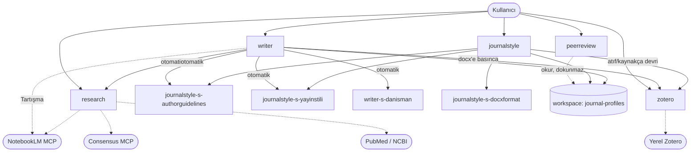

# journal eklentisi — CLAUDE.md (canlı mimari referansı)

> ## ⚠️ BAKIM KURALI (önce oku)
> **Bu bir CANLI dokümandır.** Plugin'e bir **skill / agent / reference / script / işlev**
> **eklendiğinde, değiştirildiğinde veya silindiğinde bu dosya da AYNI değişiklikle güncellenir.**
> Değişiklik hangi bileşeni etkiliyorsa ilgili tablo/bölüm elle güncellenir; yeni bir bileşen
> eklendiyse envantere satır eklenir, silindiyse satır çıkarılır. Amaç: kullanıcının plugin'in
> güncel durumunu tek dosyadan takip edebilmesi.
>
> _Son güncelleme: 2026-07-17 — workspace modeli + authorguidelines web+PDF checkpoint eklendi._

---

## 1. Genel bakış

`journal` eklentisi (marketplace: `onur-plugins`), akademik/tıbbi bir makaleyi **yaz → kaynak bul →
kaynakça bas → dergiye formatla → hakem gözünden eleştir** hattında yürüten bir Claude Code
eklentisidir. İçerik Türkçedir. **5 skill + 4 agent** barındırır; komut/hook/MCP sunucu tanımlamaz
(dış MCP sunucularını — NotebookLM, Consensus, PubMed — yalnız *tüketir*).

Manifestler:
- `.claude-plugin/plugin.json` — `name: journal`, `version: 1.0.0`; 5 skill + 4 agent listeler.
- `.claude-plugin/marketplace.json` — `name: onur-plugins`; tek plugin (`source: "."`).

---

## 2. Workspace modeli (ÇALIŞMA klasörü)

Plugin artık her çalışmayı **kaynak `.docx`'in bulunduğu klasör** üzerinden yürütür. Örnek PDF'ler,
profil önbelleği ve çıktılar bu klasörde tutulur (plugin'in içinde değil).

```
<workspace = kaynak .docx klasörü>/
  <makale>.docx                              kaynak (kullanıcı koyar)
  yayinstili-pdf/<slug>/*.pdf                dergiden örnek makale PDF'leri (stil analizi)
  authorguidelines-pdf/<slug>/*.pdf          derginin yazar kılavuzu PDF'i
  journal-profiles/<slug>.json               resmi kural profili (plugin üretir)
  journal-profiles/<slug>.yayinstili.json    fiili yayın stili (plugin üretir)
  ciktilar/<makale>_<slug>.docx              formatlanmış çıktı
  README.md                                  iskele yer tutucu
```

- **Çözümleme + iskele:** `skills/journalstyle/scripts/workspace.py`. Kaynak `.docx` yolundan
  workspace'i türetir, eksik alt klasörleri + README'yi **otomatik oluşturur** (idempotent) ve
  JSON yol raporu basar. `<slug>` örn.: The Spine Journal → `thespinejournal`.
- **Boşsa web'e düşülür:** `yayinstili-pdf/<slug>/` veya `authorguidelines-pdf/<slug>/` boşsa ilgili
  agent web yedeğine düşer (içerik yine üretilir).
- **Script yolları:** Bash'ten çağrılan tüm plugin script'leri `${CLAUDE_PLUGIN_ROOT:-$(pwd)}` ile
  çağrılır (global kurulumda cwd = workspace olduğu için göreli `scripts/...` kırılır). _İstisna:
  `research/*` ve `zotero/*` script'leri hâlâ cwd-göreli yolla anılıyor — ileride aynı desene
  taşınabilir._

---

## 3. Hızlı tetikleyici tablosu (hangi söz hangi skill'i açar)

| Ne dersen (tetikleyici) | Açılan skill | Söylemen gereken (zorunlu) |
|---|---|---|
| "… **yaz**", "giriş/tartışma/özet yaz", "makale metni oluştur", "şu bölümü [dergi] stiline göre yaz" | **writer** | hedef dergi + makale türü + kaynak dosya + dil + *(hangi bölüm; yoksa tümü)* |
| "… için **formatla**", "submission için hazırla", "dergi şablonuna uydur", "yazar kılavuzuna göre düzenle" | **journalstyle** | `.docx` + hedef dergi adı *(+ makale türü)* |
| "**kaynak bul**", "referans doğrula/ekle", "PubMed'de ara", "Consensus", "PDF'lerimde ara", "şu iddiayı destekle" | **research** | iddia/cümle ya da konu *(writer bunu otomatik tetikler)* |
| "**zotero**", "kütüphaneme ekle", "DOI/PMID ile ekle", "Word'e kaynakça bas", "atıf stilini değiştir" | **zotero** | `.docx` + *(ekleme için)* DOI/PMID **veya** istenen atıf stili |
| "**hakem** değerlendirmesi yap", "reviewer gözünden eleştir", "gönderim öncesi eleştir", "yayına hazır mı" | **peerreview** | makale (`.docx`/`.pdf`/`.md`) + *(ops.)* dergi + çalışma tipi |
| "**analiz** yap", "t-testi", "ANOVA", "korelasyon", "regresyon", "istatistik profesörü" | *analiz-profesoru* *(eklenti dışı, global skill)* | veri seti |

---

## 4. Skill envanteri (detay)

### 4.1 journalstyle — dergiye mekanik formatlama
- **Amaç:** kaynak `.docx`'i hedef derginin yazar kurallarına uyan bir `.docx`'e çevirir (font,
  punto, satır aralığı, kenar boşlukları, sayfa boyutu, bölüm sırası kontrolü). **Atıf/kaynakçaya
  DOKUNMAZ** (o zotero'nun işi).
- **Akış:** (0) `workspace.py` ile workspace çöz + iskele → (2) resmi profil (`<slug>.json`) al →
  **authorguidelines web+PDF checkpoint** → (2.5) yayın stili (`<slug>.yayinstili.json`) → (3)
  kaynak yapı analizi → (4) `docxformat` ile biçim uygula, çıktı `ciktilar/` → (5) doğrula + rapor.
- **Çağırdığı agent'lar:** `journalstyle-s-authorguidelines`, `journalstyle-s-yayinstili`,
  `journalstyle-s-docxformat`.
- **Reference:** `journalstyle-r-authorguidelines.md` (resmi kural şeması),
  `journalstyle-r-yayinstili.md` (fiili stil şeması).
- **Script:** `workspace.py`, `apply_profile.py`, `extract_docx_structure.py`, `extract_pdf_text.py`.
- **Şablon/örnek:** `references/journal-profiles/_example-mdpi.json` (şablon),
  `references/yayinstili-pdf/`, `references/authorguidelines-pdf/` (ESKİ örnek konum — artık
  workspace kullanılır).

### 4.2 writer — dergi stilinde bölüm yazımı
- **Amaç:** bir makale bölümünü (Giriş/Metot/Bulgular/Tartışma/Özet/Sonuç) hedef derginin stiline
  ve kullanıcının sesine uygun yazar. Metni yazan tek skill.
- **Otomatik çağırdıkları (kullanıcı ayrıca çağırmaz):**
  1. `journalstyle-s-authorguidelines` — *koşullu:* profil yoksa üretir (web+PDF checkpoint).
  2. `journalstyle-s-yayinstili` — fiili yayın stili.
  3. `writer-s-danisman` — bölüm iskeleti + raporlama kılavuzu (STROBE/CONSORT…).
  4. `research` (skill) — atıfsız her bilimsel cümle için gerçek DOI/PMID. Uydurmaz.
  5. `zotero` (`zotero_cite.py`) — docx'e basılırsa metin-içi atıf + kaynakça.
  6. **NotebookLM** — yalnız Tartışma yazarken literatür karşılaştırması.
- **Reference:** `writer-s-danisman-r-bilgi.md`, `writer-s-danisman-r-guidelines/`
  (ARRIVE/CARE/CONSORT/PRISMA/STARD/STROBE madde düzeyi).
- **Not:** writer yalnızca `{{zref:ITEMKEY}}` işaretçisi basar; atıf/kaynakçayı zotero uygular.

### 4.3 research — gerçek, doğrulanabilir kaynak bulma
- **Amaç:** bir bilimsel/klinik iddiayı destekleyen **gerçek** referansları (DOI/PMID) bulur;
  **asla uydurmaz**. writer bunu otomatik tetikler.
- **Kaynak sırası:** yerel `pdflerim/` → NotebookLM (MCP) → Consensus / PubMed (MCP; MCP yoksa
  `pubmed_eutils.py` ile auth'suz NCBI E-utilities).
- **Reference:** `research-r-consensus.md`, `research-r-kunye.md`, `research-r-pdf.md`.
- **Script:** `search_pdfs.py`, `pubmed_eutils.py`. Ayrıca `README.md`, `LICENSE.txt`.

### 4.4 zotero — docx atıf + kaynakça (tek yetkili)
- **Amaç:** kullanıcının **yerel Zotero'suna** bağlanır (`zotero.sqlite` / yerel API
  `127.0.0.1:23119`); docx'e metin-içi atıf + kaynakça basar, atıf stilini dönüştürür. Docx'te
  atıf/kaynakça yalnız bu skill'in yetkisindedir.
- **Reference:** `add-methods.md`, `citation-format.md`, `storage-bridge.md`, `styles.md`,
  `zref-protocol.md`.
- **Script:** `zotero_cite.py`, `zotero_lib.py`.

### 4.5 peerreview — gönderim öncesi eleştirel hakem
- **Amaç:** makaleyi reviewer gözünden eleştirir; **dosyaya dokunmaz** (salt-okur rapor üretir).
- **Kalibrasyon:** workspace'teki `journal-profiles/<slug>.json` + `<slug>.yayinstili.json`
  profillerini okur (workspace.py ile çözer); yoksa genel standartla değerlendirip raporda belirtir.
- **Reference:** `peerreview-r-common-issues.md`. Ayrıca writer'ın raporlama-kılavuzu referanslarını
  ve workspace profillerini **yeniden kullanır (dokunmaz)**.

---

## 5. Agent envanteri (detay)

| Agent | Tools | Çağıran | Görev / çıktı |
|---|---|---|---|
| **journalstyle-s-authorguidelines** | WebSearch, WebFetch, Read, Write | journalstyle, writer | Resmi yazar kurallarını çıkarır. **Web araması HER ZAMAN**; workspace'te PDF varsa ondan da **ayrıca** okur. İki bulguyu **BİRLEŞTİRMEZ** — `web_findings` + `pdf_findings` + kısa `web_ozet` döndürür. Final `<slug>.json`'ı skill, kullanıcı checkpoint'inden sonra yazar. |
| **journalstyle-s-yayinstili** | WebSearch, WebFetch, Read, Write, Bash | journalstyle, writer | Derginin **fiili yayın geleneklerini** (tablo/şekil sayısı, caption, referans sayısı, zaman/ses, atıf yoğunluğu) çıkarır. Birincil kaynak workspace `yayinstili-pdf/<slug>/` PDF'leri (`extract_pdf_text.py`); yoksa web. `<profiles_dir>/<slug>.yayinstili.json` yazar. Metne dokunmaz. |
| **journalstyle-s-docxformat** | Bash, Read, Write, Edit | journalstyle | `apply_profile.py` ile mekanik biçimlendirme (font/punto/aralık/kenar/sayfa) uygular; bölüm sırası/eksik bölüm kontrolü yapar. |
| **writer-s-danisman** | Read, Grep, Glob | writer | Bölümün IMRaD iskeleti + çalışma tipine uygun raporlama kılavuzu (STROBE/CONSORT/STARD/CARE/PRISMA) + sık hatalar. **Atıf üretmez.** |

---

## 6. Etkileşim haritası (kim kimi çağırır)



**Özet:**
- **writer** en çok bağlanan skill: research + 3 journalstyle bileşeni + zotero + NotebookLM.
- **journalstyle** 3 alt-agent'ını çağırır, atıf işini **zotero**'ya devreder.
- **peerreview** workspace profillerini yalnız **okur**, hiçbir dosyaya dokunmaz.

---

## 7. Tek-sahiplik (kim neyi yapar)

| İş | Sahip skill |
|---|---|
| Bölüm metnini **yazmak** | **writer** *(sadece `{{zref:ITEMKEY}}` işaretçisi basar)* |
| Gerçek **kaynağı bulmak/doğrulamak** (DOI/PMID) | **research** |
| docx **atıf + kaynakça** (numaralama, stil) | **zotero** *(tek yetkili)* |
| **Mekanik biçim** (font, kenar, bölüm sırası) | **journalstyle** |
| Gönderim öncesi **hakem** değerlendirmesi | **peerreview** *(dosyaya dokunmaz)* |

**Submission-hazır sıra (elle, ayrı komutlar):**
`yaz` (writer) → `Word'e kaynakça bas` (zotero) → `[dergi] için formatla` (journalstyle) →
`hakem değerlendirmesi yap` (peerreview)

---

## 8. Author guidelines — web + PDF checkpoint (önemli davranış)

1. `journalstyle-s-authorguidelines` **her durumda web araması** yapar.
2. Workspace'te `authorguidelines-pdf/<slug>/` altında PDF varsa ondan da **ayrıca** kural çıkarır.
3. Agent iki bulguyu **birleştirmez**; `web_findings` + `pdf_findings` + kısa `web_ozet` döndürür.
4. Skill **web özetini kullanıcıya gösterir** ve sorar: *birleştir / sadece web / sadece PDF / manuel*.
5. Final `<slug>.json`'ı **skill**, kullanıcı kararına göre yazar (`guidelines_source`: `web` /
   `user-pdf` / `both-merged`).

---

## 9. Kırmızı çizgiler (hepsinde geçerli)
- Gerçek olmayan kaynak/atıf **üretilmez** (research asla uydurmaz).
- Docx atıf/kaynakça **yalnız zotero**'nun yetkisinde.
- Telif: örnek makale/kılavuz PDF'lerinden **verbatim cümle/caption kopyalanmaz**; yalnız sayısal
  metrik ve kural biçiminde yapı çıkarılır.
- Emin olunmayan dergi kuralı **uydurulmaz** — `null` bırakılır, kullanıcı uyarılır.

---

## 10. Bileşen envanteri (hızlı dosya listesi — değişince güncelle)

| Tür | Yol |
|---|---|
| Manifest | `.claude-plugin/plugin.json`, `.claude-plugin/marketplace.json` |
| Skill | `skills/{journalstyle,writer,research,zotero,peerreview}/SKILL.md` |
| Agent | `agents/{journalstyle-s-authorguidelines,journalstyle-s-yayinstili,journalstyle-s-docxformat,writer-s-danisman}.md` |
| journalstyle script | `skills/journalstyle/scripts/{workspace,apply_profile,extract_docx_structure,extract_pdf_text}.py` |
| research script | `skills/research/scripts/{search_pdfs,pubmed_eutils}.py` |
| zotero script | `skills/zotero/scripts/{zotero_cite,zotero_lib}.py` |
| Kılavuz (bu dosya) | `kullanımkılavuzu.md` |
