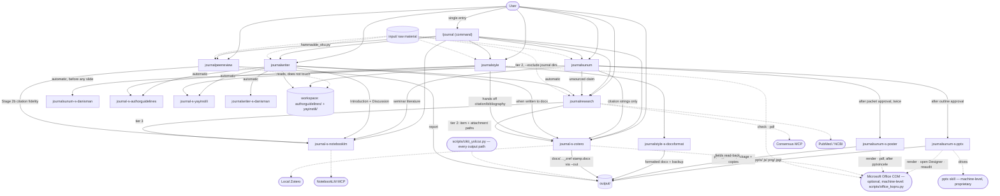

# journal plugin — CLAUDE.md (living architecture reference)

> ## ⚠️ MAINTENANCE RULE (read first)
> **This is a LIVING document.** When a **skill / agent / reference / script / function** is
> **added to, changed in, or removed from the plugin, this file is updated with the SAME change.**
> Goal: let the user track the plugin's current state from a single file.
>
> **Four routing surfaces move together.** A component change lands in all of them in one edit:
> (1) this file's §3 trigger table, §5 agent table, §6 map, §7 ownership and §10 inventory;
> (2) the root **`README.md`** contents table and its "N skills + N agents" heading;
> (3) **`commands/journal.md`** §2 intent table; (4) **`.claude-plugin/plugin.json`**.
>
> **This file states the current state only.** The reason behind a rule, the incident that
> produced it and every earlier form live in `docs/CHANGELOG.md` (oldest first; append there).
> Since 1.28.0 this file is kept under ~25 KB because it is loaded in every session.

---

## 1. Overview

The `journal` plugin (marketplace: `plugin-journal`) runs an academic/medical manuscript along
**write → find sources → generate bibliography → format for the journal → critique as a reviewer**,
and branches into a presentation/poster after submission. Documentation is English; skill and
agent `description` fields are Turkish so they trigger on the user's phrasing (`journalresearch`
and `journal-s-notebooklm` are English). **1 command + 5 skills + 9 agents** + one Stop hook
(`hooks/hooks.json`, job-folder stamps, §2); no MCP servers of its own (it consumes NotebookLM,
Consensus, PubMed).

**Manifests.** `.claude-plugin/plugin.json` — `name: journal`, the **only** place a version is
written; `description` states the team scope and the single entry point `/journal` and must match
`.claude-plugin/marketplace.json` (`name: plugin-journal`, `source: "."`; install id
`journal@plugin-journal`). No `SKILL.md` carries a `version:` field.

**Release (hand-run, every time):** bump `plugin.json`, append a `docs/CHANGELOG.md` entry, commit,
push to `onurdavutdag/plugin-journal`, then `claude plugin update journal@plugin-journal` and read
the version folder under `~/.claude/plugins/cache/plugin-journal/journal/`. The marketplace is
GitHub-sourced: an unpushed edit installs nothing. No hook does any of this.

**Machine-level environment:** `ZOTERO_DATA_DIR` (shared Zotero library) and `JOURNAL_PLUGIN_HOME`
(the checkout holding `input/` + `output/`, §2), both persistent user variables read only by a
Claude Code process started after they were set. Microsoft Office (PowerPoint, Word) is
**detected, not configured** (`scripts/office_kopru.py`, §2): present → real-app preview, PDF,
Word read-back, safe edit; absent → exit 2 `no_office` and every caller falls back.

---

## 2. Workspace model — `input/` + `output/` at the checkout root, or the docx's folder

`skills/journalstyle/scripts/journalstyle_calismaklasoru.py` resolves the workspace, scaffolds the
missing folders (idempotent) and prints one JSON; callers use only its keys (`mode`, `home`,
`sources_dir`, `outputs_dir`, `output_layout`, `stamp`, `authorguidelines_dir`, `yayinstili_dir`,
`*_slug_dir`, PDF lists, `legacy_dirs`), never a literal folder name. Three modes:

| `mode` | when | `sources_dir` | `outputs_dir` | `output_layout` |
|---|---|---|---|---|
| `plugin-home` | target under `<home>/input/` (or `<home>/output/`, a revision round) | `input/` | `output/` | `ext-subdir` |
| `plugin-home-job` (1.28.0) | target under `<home>/input/<job>/` — one piece of work = one folder | `input/<job>/` | `output/<job>/` | `flat` |
| `docx-folder` | a source `.docx` anywhere else | the docx's folder | `ciktilar/` | `ext-subdir` |

**Job-folder stamp (1.30.0, user rule 2026-10-04).** Every job folder under `input/` and `output/`, and
every user folder inside `input/<job>/` except `research/`, `referanslar/`, `yedekler/`, is named
`<YYYYMMDD HHMM> <identity>` — the newest file mtime beneath it. The plugin's **Stop hook** runs
`scripts/isklasoru_addamgala.py --hook` after every turn (artefact `output/.isklasoru_damga_son.json`);
it skips a folder written in the last 120 s, one holding an open file (`kilitli`), or a taken name.
Input and output stamps differ, so a job is found by **identity** (`cikti_yolcoz.damga_ayir` /
`is_klasoru_bul`): the resolver returns `job` (real input folder name) + `job_id` (identity), and
`yol_tazele` maps a path handed out before a re-stamp (`cikti_yolcoz.py` CLI, `detect_home`). Any other
tool given a stale path fails — re-read the current name from `hammadde_oku.py --list` (`is_kimlik`).

`<home>` comes from the plugin-root `scripts/hammadde_kokcoz.py`: env `JOURNAL_PLUGIN_HOME` →
cwd if its `.claude-plugin/plugin.json` says `"name": "journal"` → `CLAUDE_PLUGIN_ROOT` /
this script's grandparent — the first candidate with an `input/` directory wins; none → `{"error":
"no_input_root"}` exit 2, the skills ask for a path and scaffold nothing. `input/` is never
created (its presence is the checkout signal); `input/` and `output/` are git-ignored, so the
installed copy under `~/.claude/plugins/cache/` never contains them (S8 reports BILGI).

```
<home = JOURNAL_PLUGIN_HOME>/
  input/                                   raw material, placed by the user, never written
    <file>.docx/.xlsx/.csv/.pptx/.pdf/.md   plugin-home: loose files
    <job>/…                                plugin-home-job: everything of one job (+ referanslar/, research/, pptx/)
    yayinstili/<slug>/*.pdf · yayinstili/<slug>.yayinstili.json          sample articles · actual style
    authorguidelines/<slug>/*.pdf · authorguidelines/<slug>.json         guideline PDF · rule profile
  output/
    <ext>/<name> <stamp>.<ext>             plugin-home (docx/, md/, pdf/, pptx/, js/, png/, jpg/)
    <job>/<name> <stamp>.<ext>             plugin-home-job: flat, every extension side by side
    …/yedekler/<document>/                 earlier versions of the same document, never deleted
    .office_kopru_last.json                state file of `office_kopru.py open`
```

**Output path — `scripts/cikti_yolcoz.py`, always.** No skill or agent composes an output name:
`python scripts/cikti_yolcoz.py --outputs-dir … --ad … --uzanti … [--ek …] --damga "<stamp>"
[--kaynak <file read from that folder>] [--paket] [--duz]` → `{"path", …}`. Rules it owns: the
`<ext>/` subfolder (none with `--duz`, the `flat` layout), the job-start **stamp** at the end of
every name (one stamp per run; the stamp *is* the version — never `_vN`), ` -2` on a collision,
nothing at the `outputs_dir` root (ext-subdir), the poster package folder (`--paket`), and the
**backup sweep**: resolving a new file moves the earlier versions of the **same document**
(`belge_anahtari` = name without side suffix / trailing stamp; `_zref`/`_zref_updated` share the
base key; a one-word tail after the stamp keeps the key; in the flat layout the key spans
extensions) into `yedekler/<document>/`, skipping the same or a newer stamp, `~$` lock files,
locked files (`yedek_atlanan`, retried next time) and `--kaynak` paths (`yedek_ertelenen`).
`--supur <dir> [--kuru] [--duz]` sweeps a whole folder; `--geri-al <dir> [--kuru] [--duz]` brings
a document's newest version back. Pre-1.16 folders (`*-pdf/`, `journal-profiles/`) are only
reported as `legacy_dirs`, never moved.

**Profiles sit beside their source:** the rule profile `authorguidelines/<slug>.json` (web + PDF,
user checkpoint — §8), the de-facto style `yayinstili/<slug>.yayinstili.json` (written by its
agent). Empty `<slug>/` folders → the agents fall back to the web. `<slug>` e.g. The Spine Journal
→ `thespinejournal`. A **congress abstract** has no profile: the current edition's rule page is
read and quoted (journalwriter step 2, journalpeerreview calibration) and checked with
`journalstyle_ozetdenetle.py` (1.28.0: word count with/without references, headings, title
abbreviations, author titles, citation numbers).

**Raw-material reader — `scripts/hammadde_oku.py`.** `--list` inventories `input/` (excludes the
two journal subtrees and `~$*`; groups entries by job folder in `isler`), `"<file>"` returns
`{type, backend, ok, summary, text, total_chars, truncated, warnings}` for docx/pdf/pptx/xlsx/csv/
md/txt with `--outline`, `--heading X` (document order, tables in place, TOC-blind), `--sheet N`,
`--max-rows`, `--pages a-b`, `--visible` (drops struck-through runs), `--full`/`--max-chars`.
Dependency-free fallbacks for every format; corrupt file → `ok:false`, exit 0. It never computes
the structural metrics `journalstyle_docxyapicikar.py` owns.

**Office bridge — `scripts/office_kopru.py`** (PowerShell 5.1 COM via `-EncodedCommand`; no
pywin32; one JSON; exit 0 / 1 / 2). `probe` · `check` (invisible read-only: repair prompt,
Protected View, page/slide count and size, `fonts_missing`, Word `compat_mode`) · `render` (PNG
per slide + contact sheet; Word via PDF + `pdftoppm`) · `pdf` · `open` (visible hand-off,
`--pane designer|accessibility`, `PrintWindow` proof PNG) · `fields` (Word `ADDIN ZOTERO_*`
census; `--update` only into `--out`) · `hunt` (capture every visible window — the modal
detector) · `close` (only the file `open` recorded) · **`edit`** (1.28.0, Word: one COM call
`SaveAs2 → Find → replace/highlight → Save`, attaches to the user's open document, 60 s timeout,
result verified **from disk** — `verified_on_disk`, `original_mtime_changed`, lock file, WINWORD
pids). `--outputs-root <outputs_dir>` places PNGs under `png/`, grids under `jpg/`, PDFs under
`pdf/`; without it the `--out-dir`/beside-the-file behaviour holds. Contracts: exit 2
`no_office`; exit 1 `modal_detected` (+`_modal-N.png`) / `timeout` / `com_error` / `unsafe_input`;
`owned_instance` = a process `New-Object` started (PowerPoint is single-instance and is never
`Quit`; Word is always owned, quit, and stopped if it survives — `leaked_killed`); `DisplayAlerts`
untouched unless `--quiet-alerts`; a file under `input/` is opened read-only. Designer's choices
and the Accessibility Checker are the user's; a saved deck is re-audited, never regenerated.

**Resource paths.** Every path that crosses a component boundary is
`${CLAUDE_PLUGIN_ROOT:-$(pwd)}/skills/<skill>/{scripts,references}/…` or
`${CLAUDE_PLUGIN_ROOT:-$(pwd)}/{scripts,references}/…` for plugin-root resources (zotero scripts
and references, `hammadde_*`, `cikti_yolcoz.py`, `office_kopru.py`, `notebooklm-r-rehber.md`) —
agents have no anchor and must use the prefix; the only bare path is a skill naming its own
bundled `references/foo.md`.

---

## 3. Quick trigger table (which phrase opens which skill)

Every skill still triggers on its own phrasing. **If you do not know which one you need, type
`/journal <your request>`** — the command picks the owner for you (see §3.5).

| What you say (trigger) | Skill opened | What you must state (required) |
|---|---|---|
| `/journal <request>`, or `/journal` alone | **the command** — routes to the right skill/agent | nothing up front; it asks for what is missing |
| "… **write**", "write intro/discussion/abstract", "create manuscript text", "write this section in [journal] style" | **journalwriter** | target journal + article type + source file + language + *(which section; if none, all)* |
| "**format** for …", "prepare for submission", "match the journal template", "arrange per author guidelines" | **journalstyle** | `.docx` + target journal name *(+ article type)* |
| "**find sources**", "verify/add references", "search PubMed", "Consensus", "search my PDFs", "support this claim" | **journalresearch** | claim/sentence or topic *(journalwriter triggers this automatically)* |
| "add to my library", "add by DOI/PMID", "write bibliography into Word", "change citation style" — a FILE is processed | **`journal-s-zotero`** *(agent)* | `.docx` + *(to add)* DOI/PMID **or** the desired citation style |
| "do a **peer review**", "critique from a reviewer's view", "critique before submission", "is it ready to publish" | **journalpeerreview** | manuscript (`.docx`/`.pdf`/`.md`) + *(opt.)* journal + study type |
| "**kongre sunumu** hazırla", "bildiri sunumu", "**poster** hazırla", "tez savunması sunumu", "seminer / journal club / olgu sunumu", "makaleden sunum çıkar", "bu desteyi eleştir", "savunma videosu", "animasyonlu şekil" | **journalsunum** | type (congress / poster / defence / seminar) + duration *(or organiser + printer rules for a poster)* + audience + language + source material *(manuscript / thesis / paper)* — generic `.pptx` mechanics go to the global `pptx` skill, not here |
| "do **analysis**", "t-test", "ANOVA", "correlation", "regression", "statistics professor" | *istatistik-profesoru* *(outside the plugin, global skill)* | dataset |

---

## 3.5 Command inventory — `/journal` (the single entry point)

**File:** `commands/journal.md` · **Frontmatter:** `description` (Turkish, shown in `/help`) +
`argument-hint` (**quoted** — an unquoted value starting with `[` is YAML flow-sequence syntax and
parses as a list). The body is written as instructions **to Claude**, per
`plugin-dev:command-development`. The command appears namespaced as **`/journal:journal`** (plugin
`journal` + command `journal`), alongside the skills' `/journal:journalwriter`, `/journal:journalresearch`, …

- **Purpose:** the user describes the job in one line; the command works out **who owns it**, collects
  that owner's required information and hands over. It is a router — it writes no text, formats no
  file, prints no citation, produces no review.
- **Why a command, not a skill:** a router skill would auto-trigger on the same sentences as the
  specialist skills and add a needless hop. A command fires only when typed, so the existing
  natural-language triggers keep working unchanged.
- **With no argument:** asks with `AskUserQuestion` — write a section · find/verify sources · citations
  + bibliography into Word · format for the journal (peer review, **presentation/poster**, NotebookLM
  and the full pipeline are reached through the free-text "Other" answer, since the tool allows 4
  options; the command's §1 names them so a free-text answer is routed, not re-asked).
- **Routing:** the intent table in the command mirrors §3 and §7 and must be updated whenever those
  change. It also routes statistics requests **out** of the plugin to the global `istatistik-profesoru`.
- **Full pipeline mode** ("baştan sona hazırla"): runs the §7 submission-ready order
  journalwriter → journal-s-zotero → journalstyle → journalpeerreview, **asking for approval between steps** — never silently.
- **Limits:** does not call sub-agents on the user's behalf (the skills call their own). Two
  exceptions §5 lists as directly callable: `journal-s-notebooklm` and `journal-s-zotero` — the
  latter because since 1.7.0 it has no owning skill, so the command reaches it directly. The §9
  red lines apply.

---

## 4. Skill inventory (detail)

### 4.1 journalstyle — mechanical formatting for the journal
- **Purpose:** converts the source `.docx` into a `.docx` that conforms to the target journal's
  author guidelines (font, size, line spacing, margins, page size, section-order check). **Does NOT
  touch citations/bibliography** (that is `journal-s-zotero`'s job).
- **Missing required section:** Step 3 names them and asks; on approval Step 4's agent adds each one
  as an empty Word heading at the **end** of the file (`journalstyle_docxbicimuygula.py --add-sections`). Section
  order is never rearranged automatically — content-loss risk.
- **Word read-back (1.19.0):** step 5 runs `scripts/office_kopru.py check` on the formatted docx
  when Word is installed — repair prompt, Protected View, compat mode, page count/size and
  `fonts_missing` go into the compliance report; `pdf` gives the submission PDF on request.
  `no_office` → "verification stays manual", never a failure.
- **Flow:** (0) resolve workspace + scaffold with `journalstyle_calismaklasoru.py` → (2) get the official profile
  (`<slug>.json`) → **authorguidelines web+PDF checkpoint** → (2.5) publication style
  (`<slug>.yayinstili.json`) → (3) source structure analysis → (4) apply format with `docxformat`,
  output + backup to `<outputs_dir>/docx/… <stamp>.docx` (paths from `cikti_yolcoz.py`; `output/`
  in plugin-home mode, `ciktilar/` otherwise) → (5)
  verify + report. Step 0a (1.17.0): no file named → `scripts/hammadde_oku.py --list` offers the
  `input/` docx entries.
- **Agents it calls:** `journal-s-authorguidelines`, `journal-s-yayinstili`,
  `journalstyle-s-docxformat`.
- **Reference:** `journalstyle-r-authorguidelines.md` (official rule schema),
  `journalstyle-r-yayinstili.md` (actual style schema).
- **Scripts:** `journalstyle_calismaklasoru.py` (three modes since 1.28.0: `plugin-home`, `plugin-home-job` — a
  source under `input/<job>/`, outputs flat in `output/<job>/` — and `docx-folder`), `journalstyle_docxbicimuygula.py`,
  `journalstyle_docxyapicikar.py`, `journalstyle_pdfmetincikar.py`, `journalstyle_ozetdenetle.py` (1.28.0, congress-abstract
  compliance — word count with/without references, headings, title abbreviations, author titles, citation numbers),
  `journalstyle_docxgorunmeyenigorur.py` (shared helper: paragraph walk covering tables/headers/footers, inline+anchored
  drawing count, utf-8 stdout — imported by the other journalstyle scripts only; `zotero_docxatifbas.py`
  keeps its own copy so the plugin-root zotero scripts depend on no skill).
- **Template/example:** `references/journal-profiles/_example-mdpi.json` (the only file kept there —
  live profiles belong to the workspace). **No PDF is kept in the plugin's shipped tree.** Sample
  article and author-guideline PDFs live in the workspace (`yayinstili/<slug>/`,
  `authorguidelines/<slug>/` next to the source `.docx`, or under the checkout's git-ignored
  `input/` in plugin-home mode); the old local copies were moved out to
  `Desktop\claude working\output\journal-pdf-arsiv\`. `.gitignore` keeps `*.pdf`, `*.docx`, `*.pptx`,
  `*.xlsx`, `input/` and `output/` out of git, and because the marketplace source is GitHub nothing
  git ignores reaches an installed copy — `klasoredit:klasoreditplugin` **S8** reports it as BILGI (§2);
  a PDF in the *shipped* tree would still be a real S8 finding.

### 4.2 journalwriter — section writing in journal style
- **Purpose:** writes a manuscript section (Introduction/Methods/Results/Discussion/Abstract/
  Conclusion) in the target journal's style and the user's voice. The only skill that writes text.
- **What it calls automatically (the user does not call these separately):**
  1. `journal-s-authorguidelines` — *conditional:* produces the profile if none exists (web+PDF checkpoint).
  2. `journal-s-yayinstili` — *conditional:* actual publication style, only when
     `<slug>.yayinstili.json` is missing or stale. Writing several sections of one manuscript does not
     re-analyze the same journal.
  3. `journalwriter-s-danisman` — section skeleton + reporting guideline (STROBE/CONSORT…).
  4. `journalresearch` (skill) — a real DOI/PMID for every scientific sentence lacking a citation. No fabrication.
  5. `journal-s-zotero` (agent) — the two-call contract, both calls scoped to the **manuscript**, not
     the section: (1) key resolution, whose `{source → ITEMKEY}` map is held for the whole manuscript
     and extended by a delta call only when a later section brings new sources — an empty delta means
     no call at all; (2) the docx render, run **once**, when the docx is final (see journalwriter §6
     for why a per-section render leaves the bibliography at `bibliography_count: 0`).
  6. `journal-s-notebooklm` — NotebookLM literature material when writing the **Introduction**
     (background/gap: what is known, where the studies disagree, what is unstudied) and the
     **Discussion** (comparison: supporting/contradicting studies). journalwriter passes a brief; the agent
     calls the MCP tools. Content only — never a citation.
- **Reference:** `journalwriter-s-danisman-r-bilgi.md`, `journalwriter-s-danisman-r-guidelines/`
  (ARRIVE/CARE/CONSORT/PRISMA/STARD/STROBE item level).
- **Note:** journalwriter only writes a `{{zref:ITEMKEY}}` marker; `journal-s-zotero` applies the citation/bibliography.
- **Raw material (1.17.0):** thesis/draft docx, results xlsx/csv, slides pptx, PDFs, md/txt from the
  checkout's `input/`, read through the plugin-root `scripts/hammadde_oku.py` (`--outline` →
  `--heading` for a thesis, `--sheet` for a workbook); every number in the text comes from a row/cell
  the reader returned. Any docx it produces, and the zotero render (`outputs_dir` + `stamp` passed to
  the agent), land in `output/docx/` under the §2 layout.

### 4.3 journalresearch — finding real, verifiable sources
- **Purpose:** finds **real** references (DOI/PMID) that support a scientific/clinical claim;
  **never fabricates**. journalwriter triggers this automatically.
- **Source order (four tiers, strict):** (1) references the **user supplied** → (2) uploaded PDFs —
  the fixed `pdflerim/` library always, plus the checkout's `input/` (resolved with
  `hammadde_kokcoz.py`, searched with `--exclude yayinstili authorguidelines`; `no_input_root` → skip
  silently), plus the workspace, plus a named Zotero collection **through
  `journal-s-zotero`** (the agent returns items + attachment paths; the skill reads the files and
  never queries the library itself) → (3) NotebookLM **via `journal-s-notebooklm`**, not by calling
  the MCP tools itself → (4) Consensus / PubMed (MCP; if no MCP, auth-free NCBI E-utilities via
  `journalresearch_pubmedara.py`).
- **Reference:** `journalresearch-r-consensus.md`, `journalresearch-r-kunye.md`, `journalresearch-r-pdf.md`.
- **Scripts:** `journalresearch_pdfara.py`, `journalresearch_pubmedara.py`, `journalresearch_pdfvurgula.py`
  (1.28.0: highlighted copy of a source PDF — "pdfde nerede geçiyor"; 1.31.1: per-highlight note
  `--not`, page-1 sticky `--sayfa-notu`, `--json-girdi` batch with page hints, `--ocr` for scans). Cited PDFs of a job sit in
  `input/<job>/referanslar/`, merely-read ones in `research/`, named on the Vancouver pattern
  (`klasoredit:klasoreditbilim-s-pdf` when installed).
- **Local PDF pool:** `pdflerim/` (git-ignored contents) with its own `README.md` describing the search call.

### 4.4 journalpeerreview — critical pre-submission reviewer
- **Purpose:** critiques the manuscript from a reviewer's view; **does not touch the file** (produces
  a read-only report, written to `<outputs_dir>/md/` — `output/md/` in plugin-home mode — as
  `<name> YYYYMMDD HHMM.md`, the path from `cikti_yolcoz.py`; slide text via `hammadde_oku.py`,
  visuals still need PNG/JPG).
- **Calibration:** reads the `authorguidelines/<slug>.json` + `yayinstili/<slug>.yayinstili.json`
  profiles in the workspace (resolves them with journalstyle_calismaklasoru.py); if none, evaluates by
  general standards and states so in the report.
- **Reference:** `journalpeerreview-r-common-issues.md`. It also **reuses (without touching)** journalwriter's
  reporting-guideline references and the workspace profiles.
- **Citation fidelity (Stage 2b, 1.26.0):** every citation–sentence pair in scope is read against the
  cited source — `journal-s-notebooklm` with `source_get_content` (a query answer is a locator, never
  evidence), else the Zotero attachments via `journal-s-zotero` — plus uncited factual sentences and
  claims another pool source contradicts. Wrong source / misstated number → journalwriter +
  journal-s-zotero. The report ends with an **open-findings table** (id · location · owner · status)
  that journalwriter reads first on the next revision round. Why: on the C2 thesis a 26 Sep report
  flagged 29 citation errors that no later round applied, and its query-based audit missed the
  uncited and contradicted claims a full-text pass found on 27 Sep.
- **Completeness (1.27.0):** a long document is reviewed **one section per pass** and every occurrence
  of an error class is listed (no "e.g."); a Methods section without citations is a finding, a Results
  section without them is normal; **Stage 5 figure content pass** (1.30.1) reads labels and drawn/printed
  measurements inside every figure image against the text; **Stage 2c** recomputes every n (%), total, cross-table value,
  difference-column sign and header n; **Stage 2d** matches each variable's Methods definition (plane,
  reference, unit) to every Results sentence; **Stage 7** is a seven-item sentence-level list (tense,
  terms, definition logic, abbreviation format, Turkish orthography, punctuation, captions). journalwriter
  runs Stage 2c + 7 on a revised section before reporting it done. Why: the 26 Sep whole-thesis review
  sampled one example per class and recomputed no number; the 27 Sep section audits still found 27 + 39
  fixes.

### 4.5 journalsunum — academic presentation (deck or poster) from the manuscript
- **Purpose:** builds a congress oral paper, a congress poster, a thesis defence or a seminar /
  journal-club / case deck from the user's own material (`input/` manuscript, thesis, results
  tables, a paper PDF). Decides the narrative and the slide budget, gets the outline approved, and
  **hands rendering to its sub-agents** — it never draws a slide itself. Type, duration, audience,
  Q&A placement and **language are asked every time**; there is no default.
- **Flow (8 steps, SKILL.md):** clarify → resolve workspace (`journalstyle_calismaklasoru.py`;
  outputs `<outputs_dir>/pptx/<stem>_sunum <stamp>.pptx` — generator in `js/`, previews in
  `png/` + `jpg/` — or the poster package `pptx/<stem>_poster <stamp>/` + the copied
  `pptx/… .pptx` / `pdf/… .pdf`, all from `cikti_yolcoz.py`) → read the
  material (`hammadde_oku.py`) → **`journalsunum-s-danisman` automatically** (budget, skeleton,
  citation slots) → sources (`journal-s-zotero` strings; `journalresearch` for an unsourced claim;
  `journal-s-notebooklm` for seminar literature per `notebooklm-r-rehber.md`) → outline approved
  by the user → render (`journalsunum-s-pptx` for a deck, `journalsunum-s-poster` for a poster —
  the poster runs twice: manifest hash → author approval → generate) → report. Critique mode
  reads an existing deck through the render agent and passes it to the advisor. Since 1.19.0 the
  brief carries `designer: yes | no` (default yes for congress/seminar, no on a user template):
  with PowerPoint installed the deck agent's visual pass renders through real PowerPoint
  (`office_kopru.py render`), then opens the finished deck **on screen with the Designer pane**
  (`designer_handoff: opened`); the skill asks *bitti / vazgeç*, and on *bitti* re-invokes the agent
  with `mode: reaudit` — the saved deck is checked and rendered again, `generator_stale: true`,
  and any later change goes through the edit path into a newly stamped `pptx/<stem>_sunum
  <stamp>.pptx` (no `_v2` since 1.22.0), never a generator re-run.
  The poster's PDF is exported through the bridge once `pptxincele` has passed.
- **Video / animated-figure mode (1.31.0, #419):** a short defence/talk video built in the skill itself (no
  sub-agent): aspect ratio · duration · sound · playback place asked up front; sources are thesis figures
  (content pass, inpaint, geometry redrawn from traced points), the user's screen recordings (lock-screen
  frames trimmed, licence question recorded) or a parametric scene with a golden check; angles drawn only on
  their measurement plane; frames → ffmpeg (`yuv420p`, `+faststart`, `-map_metadata -1`), `ffprobe` + contact
  sheet; embedding goes to `journalsunum-s-pptx`.
- **Draft-deck mode (1.19.1):** the user's own `.pptx`/`.potx` under the checkout's `input/pptx/`
  is source material (listed by `hammadde_oku.py --list`, never written). The skill reads it through
  the render agent, has the advisor fit a skeleton to it, and asks **polish** (edit path into
  a newly stamped `pptx/<stem> <stamp>.pptx`, the draft as `--original` template, `designer: no` by default) or **rebuild**
  (the draft's text and figures feed the normal steps 4–7). Type · duration · audience · language
  are still asked.
- **Boundaries:** *academic* presentation work is this skill's; generic `.pptx` mechanics (open /
  read / merge any deck) belong to the **global, proprietary `pptx` skill** installed per machine
  (`npx skills add anthropics/skills@pptx -g`), which the deck agent drives and which this package
  does not ship — its licence forbids copying it. **Slide citations:** the strings come from
  `journal-s-zotero` and are printed as text by the render agents; the docx citation/bibliography
  authority (§7, §9) is unchanged, and `zotero_docxatifbas.py` is never run against a `.pptx`
  (python-docx cannot target it). NotebookLM's own slide artefacts are source material, never
  this skill's output path. **Designer is never run on a poster** (it re-lays out content and
  voids the approved manifest geometry and hash) and never on a deck built on the user's own
  template; the ZIP/XML package inspection always precedes any COM open of a poster.
- **References:** `journalsunum-r-{yapi,konusma,tasarim,poster,postermanifest}.md` +
  `journalsunum-poster-manifest-ornek.json` — adapted from `k-dense-ai/scientific-agent-skills`
  (`scientific-slides` 1.8, `pptx-posters` 2.2; MIT — provenance header in every file, licence in
  the root `THIRD_PARTY_NOTICES.md`). The upstream image-generation render path and the
  Beamer/LaTeX material were not taken.
- **Scripts:** the poster pipeline (`journalsunum_{manifestdogrula,gorseltara,paletdenetle,
  disaaktarimplanla,posteruret,pptxincele,yerlesimdenetle}.py`, libraries
  `journalsunum_{ortak,manifestyukle,pptxokuyaz}.py`), run by the poster agent. The generator
  enforces exact pins (`python-pptx==1.0.2`, `Pillow==12.3.0`,
  `lxml==6.1.1`) and is run under `uv run --with …` so the machine's packages are never downgraded.
- **Text budget (1.20.0):** `journalsunum_destedogrula.py` is the **deck** agent's own script
  (its first) — slide count vs duration plus the §2 text budget measured by the new library
  `journalsunum_metinolcer.py`: bullets per slide, words per bullet, body words per slide, line
  length, nesting depth, title/body font floors, a visual on the slide, a speaker note on the
  slide. Since 2026-09-21 a source/caption line directly under a figure is classified as a caption
  (position + opening word), kept out of the body budget and checked against `caption_font_min`
  (12 pt, `CAPTION_FONT_TOO_SMALL`). Dependency-free ZIP/XML (`ppt/slides/slideN.xml`, notes resolved through the slide's
  rels), so it needs no python-pptx and never opens the file; it reads only the XML parts it
  parses, which is why a 260 MB template deck measures in well under a second. It does **not**
  call `require_safe_pptx` — that profile is poster-only and rejects every multi-slide deck with
  notes. A deck with no placeholders (pptxgenjs writes plain text boxes) gets its title inferred
  from the topmost single-line shape in the upper half, recorded as `title_source: inferred`; a
  theme-inherited size is reported `FONT_SIZE_UNSPECIFIED`, never guessed. Severity follows the
  reference: a missed **target** is a warning (exit 0), a broken **ceiling** is an issue (exit 1),
  an unreadable package is exit 2. `--json` / `--output` / `--thresholds` were added for the
  agent; `--no-text-budget` restores the pre-1.20.0 behaviour and is what the **poster** agent
  passes, since a one-slide poster has no bullet budget. §2 of `journalsunum-r-tasarim.md` was
  reworded in the same change: "6×6 is the ceiling" contradicted the 4–8-word target, so the
  ceiling is now stated as 6 bullets and 36 body words per slide.
- **Exit code and privacy scan (1.21.0):** the >100 MB file-size finding is now a warning, so
  exit 1 means only a broken ceiling — a deck with embedded clinical video used to exit 1 on
  size alone. `--privacy` (draft-deck mode passes it, SKILL.md step 2) scans the package bytes
  and metadata, not the render, for patient identifiers: initials and 11-digit ID numbers in
  slide and notes text, record words (`PAT123`, "hasta no"), non-generic shape names and alt
  text, `docProps/core.xml` people fields, TIFF/DICOM media and 16-bit images whose burned-in
  overlay may be hidden or fully visible depending on the renderer (1.25.0: PowerPoint 16 drew
  one fully visible, so the message no longer claims it is clipped), plus TIFF/EXIF description
  tags, and since 1.25.0 one `PRIVACY_VIDEO_NOT_INSPECTED` item per embedded video (only the
  poster frame is readable). Output is a `privacy`
  block of **review** items; nothing is a verdict and nothing changes the exit code. Found on
  the first real run: a video shape name carrying a surname, initials, four 16-bit TIFFs. What
  the scan does not list is not thereby clean: SKILL.md draft-deck step 2 checks burned-in
  identifiers on the rendered PNG of every imaging slide (a JPEG PACS screenshot carried an
  accession number the scan cannot see — that heuristic is not implemented).
  Separately, `journalsunum-s-pptx` sets `PYTHONUTF8=1` on the pptx skill's Python scripts —
  `validate.py` otherwise fails on Turkish slide XML under cp1252 (observations 162–164).

---

## 5. Agent inventory (detail)

| Agent | Color · Tools | Caller | Task / output |
|---|---|---|---|
| **journal-s-authorguidelines** | blue · WebSearch, WebFetch, Read | journalstyle, journalwriter | Extracts the official author guidelines. **Web search ALWAYS**; if a PDF exists in the workspace, it also reads from it **separately**. It does **NOT MERGE** the two findings — returns `web_findings` + `pdf_findings` + a short `webpdf_ozet`. **No `Write`**: the skill writes the final `<authorguidelines_dir>/<slug>.json` after the user's checkpoint. Flow: `journalstyle-r-authorguidelines.md` → "Call procedure (checkpoint)". |
| **journal-s-yayinstili** | magenta · WebSearch, WebFetch, Read, Write, Bash | journalstyle, journalwriter | Extracts the journal's **actual publication conventions** (table/figure count, caption, reference count, tense/voice, citation density). Primary source is the workspace `yayinstili/<slug>/` PDFs (`journalstyle_pdfmetincikar.py`); if none, the web. **Writes its own** `<yayinstili_dir>/<slug>.yayinstili.json` (no user decision gates it) and returns the style summary defined in its "Output Format", not the raw JSON. Called **only when that file is missing or stale** — the callers check the cache first. Does not touch the text. Flow: `journalstyle-r-yayinstili.md` → "Call procedure". |
| **journalstyle-s-docxformat** | green · Bash, Read | journalstyle | Applies mechanical formatting (font/size/spacing/margins/page) with `journalstyle_docxbicimuygula.py`; checks section order/missing sections. **Every document change goes through the script** — it carries no `Write`/`Edit` (a `.docx` is a zip; writing it as text corrupts it). With the user's approval it re-runs the script with **`--add-sections`**, which appends each missing `required_sections` entry as a real Word `Heading 1` + placeholder at the end of the file. Section **order** is only reported, never rearranged (1.14.0). |
| **journalwriter-s-danisman** | yellow · Read, Grep, Glob | journalwriter | The section's IMRaD skeleton + the reporting guideline suited to the study type (STROBE/CONSORT/STARD/CARE/PRISMA) + common mistakes, in the four parts its **"Output Format"** declares (plus a critique block when a draft was passed). **Does not produce citations.** |
| **journal-s-notebooklm** | cyan · Read + 26 `mcp__notebooklm-mcp__*` tools | journalwriter, journalresearch, journalpeerreview (Stage 2b citation fidelity, 1.26.0), the user directly | **Sole owner of NotebookLM interaction.** Advisor + operator: picks the tool/persona/prompt from `references/notebooklm-r-rehber.md`, then runs it (query, studio outputs, Deep Research, source curation). Returns findings + `Claims to verify` + warnings. **Produces no citations**; writes to the user's account only after explicit approval; has **no** `notebook_delete`/`studio_delete`. Callers follow `notebooklm-r-rehber.md` → "Call procedure". |
| **journalsunum-s-danisman** | purple · Read, Grep, Glob | journalsunum | Structure advisor called **before any slide is written**: slide budget for type + duration (+ 20–30 % cut when Q&A is inside the slot), the skeleton slide by slide with the manuscript part feeding each, backup slides with the question each answers, citation slots, timing checkpoints, practice minimum — every number traced to `journalsunum-r-konusma.md` / `-r-yapi.md`. Critiques an existing deck against the pitfall list. **Produces no citations, writes no slide prose.** |
| **journalsunum-s-pptx** | orange · Read, Glob, Grep, Bash, Write, Edit, **Skill** | journalsunum | Renders the approved outline to `<outputs_dir>/pptx/<stem>_sunum <stamp>.pptx` (1.22.0 layout, every path from `cikti_yolcoz.py`) by driving the machine-level `pptx` skill (pptxgenjs generator written to `js/<stem>_sunum <stamp>.js` with absolute media paths, `validate.py`, `thumbnail.py` grid read back as an image, `markitdown` read-back); edits an existing deck through that skill's unzip/`add_slide.py`/`clean.py` path into a newly stamped file, never `_v2`. Since 1.20.0 it also runs this package's own `journalsunum_destedogrula.py --json` as validation step 5b — the §2 **text budget** measured per slide, a broken ceiling sending it back to the generator before anything is rendered. Render → grid → fix loop, up to three passes; since 1.19.0 the grid comes from **real PowerPoint** through `scripts/office_kopru.py render` when it is installed (`thumbnail.py`/LibreOffice is the fallback), `check` adds `fonts_missing` and note coverage to the inspection, and the finished deck is **handed to PowerPoint Designer on screen** (`open --pane designer`, proof PNG) when the brief says `designer: yes`; a deck the user saved is re-audited (`mode: reaudit`, `generator_stale: true`), never regenerated. A skipped visual check is reported, never hidden. Returns `blocked` with the install line when the `pptx` skill is absent. Prints citation strings verbatim; composes none. |
| **journalsunum-s-poster** | pink · Read, Glob, Grep, Bash, Write | journalsunum | Writes the strict poster manifest (`poster.json`: sources, hashed local assets, canvas + physical geometry, organiser/printer rules, WCAG pairs, reading order) from the approved evidence packet, returns the content hash for author approval, then on re-invocation runs the pipeline: validate → inventory → palette → export plan → **generate under `uv run` with exact pins** → package inspection → layout check → visual pass → PDF. **Fails closed** on any unmet gate; never approves, never fabricates. Since 1.19.0 PowerPoint is opened **only after `pptxincele` exits 0**, only through `office_kopru.py` (read-only `check`/`render --width 2400`/`pdf`; the canvas size is confirmed against the manifest, `fonts_missing` is the substitution check, the PDF lands as `<stem>_poster.pdf`); it never saves over the `.pptx` and never runs Designer on a poster. Manual checklist items (Accessibility Checker — the bridge can only open its pane —, printer proof, sign-off) are returned as the user's. |
| **journal-s-zotero** | red · Read, Glob, Grep, Bash | journalwriter, journalstyle, journalpeerreview, journalresearch, journalsunum, `/journal` | **Owns every touch of the real Zotero library.** sqlite read (works with Zotero closed) + local API write; the docx in-text citation + bibliography, style conversion and pinning. Two-call contract with journalwriter: (1) source list → `{source → ITEMKEY}` map, (2) docx path (+ `outputs_dir` since 1.17.0 and `stamp` since 1.22.0 → `--out` from `cikti_yolcoz.py`, `<outputs_dir>/docx/<stem>_zref <stamp>.docx`) → the `zotero_docxatifbas.py` JSON report whose `output` the caller carries on. Runs in its own context **so a library dump never reaches the conversation**. Fabricates no metadata; never writes to sqlite directly — the write goes through `zotero_kutuphaneyaz.py` (de-duplication + `zotero_closed` handling built in). **Carries no MCP and no web tool**, so identifier verification runs on `journalresearch_pubmedara.py` via Bash; an ISBN, an arXiv id or a DOI absent from PubMed is explicitly **not** its job and goes back to the user or to `journalresearch` (1.12.0). Fifth job since 1.13.0: **evidence paths** — journalresearch names a collection, the agent returns items + `storage/<KEY>` attachment paths and stops there; reading those PDFs is the caller's. Since 1.19.0 the render job ends with a **Word read-back** when Word is installed: `office_kopru.py fields` counts the `ADDIN ZOTERO_*` fields in the rendered docx and the report's `word_check` compares them with the script's own counts — a mismatch is reported as one; `--update` only into a new `docx/<stem>_zref_updated <stamp>.docx` on the user's ask. |

**Naming (1.8.0):** the prefix states **ownership**, and every agent declares it in a `skills:`
frontmatter array so the claim is machine-checkable. **Five** agents belong to a single skill and
keep the `<skill>-s-<role>` form: `journalstyle-s-docxformat` (`["journalstyle"]`),
`journalwriter-s-danisman` (`["journalwriter"]`) and, since 1.18.0, the three `journalsunum-s-*`
agents (`["journalsunum"]`). The other **four** carry the `journal-s-` plugin
prefix because no single skill owns them — `journal-s-authorguidelines` and `journal-s-yayinstili`
(`["journalstyle", "journalwriter"]`; renamed from `journalstyle-s-*` in 1.8.0 once the second caller
was declared), `journal-s-notebooklm` (`["journalwriter", "journalresearch", "journalpeerreview"]` + direct user calls),
and `journal-s-zotero` (`[]` — no owning skill at all since 1.7.0; the empty array is deliberate,
not an omission).

**Format:** all nine agents follow the `plugin-dev:agent-development` spec — `name` + `description`
(trigger conditions + typical triggers + pointer to the body) + `model: inherit` + `skills:` + a
distinct `color` (authorguidelines blue · yayinstili magenta · docxformat green · danisman yellow ·
notebooklm cyan · journal-s-zotero red · journalsunum-s-danisman purple · journalsunum-s-pptx
orange · journalsunum-s-poster pink) + array-form `tools`, and a
body carrying "When to invoke" … "Edge Cases". `journalsunum-s-pptx` is the first agent granted the
**`Skill`** tool, so it can load the machine-level `pptx` skill; if the harness refuses that grant it
falls back to Reading that skill's `SKILL.md` by path, as its body says.
Agent `description` fields stay Turkish (except notebooklm) so they trigger on the user's own
phrasing — the spec prescribes the structure, not the language.

**Approval gates live in the caller, not the agent.** No agent holds `AskUserQuestion`, and a subagent
has no channel to the user mid-run; every "ask the user first" in an agent body therefore means
*return the question to the calling skill*, which asks and re-invokes. The wording stays because the
agent must know the action is gated; the mechanism is the return. The re-invocation quotes the user's
answer verbatim; that quote is the approval and the agent runs the gated action itself — NotebookLM
`source_delete` included (2026-10-03, #365).

**Colours (1.9.0, extended 1.18.0):** 9 agents, 9 distinct colours. `journal-s-zotero` keeps `red`
as the library-mutating agent (the spec's "critical" sense fits); the two render agents mutate only
files they create under `<outputs_dir>` and never a source.

---

## 6. Interaction map (who calls whom)


```mermaid
flowchart TD
    U([User]) --> W[journalwriter]
    U --> J[journalstyle]
    U --> R[journalresearch]
    U --> Z[journal-s-zotero]
    U --> P[journalpeerreview]
    U --> S[journalsunum]

    U -->|single entry| C["/journal (command)"]
    C --> W
    C --> J
    C --> R
    C --> Z
    C --> P
    C --> S
    C --> NLMA

    S -->|automatic, before any slide| SD[journalsunum-s-danisman]
    S -->|after outline approval| SP[journalsunum-s-pptx]
    S -->|after packet approval, twice| SPO[journalsunum-s-poster]
    S -->|citation strings only| Z
    S -->|seminar literature| NLMA
    S -->|unsourced claim| R
    SP -.->|drives| PPTX([pptx skill — machine-level, proprietary])
    IN -.-> S
    SP -->|pptx/ js/ png/ jpg/| OUT
    SPO -->|pptx/<stem>_poster <stamp>/ package + copies| OUT

    W -->|automatic| R
    W -->|automatic| AG[journal-s-authorguidelines]
    W -->|automatic| YS[journal-s-yayinstili]
    W -->|automatic| DAN[journalwriter-s-danisman]
    W -->|when written to docx| Z
    W -->|Introduction + Discussion| NLMA[journal-s-notebooklm]
    NLMA -.-> NLM([NotebookLM MCP])

    J --> AG
    J --> YS
    J --> DF[journalstyle-s-docxformat]
    J -->|hands off citation/bibliography| Z

    P -.->|reads, does not touch| PROF[(workspace: authorguidelines/ + yayinstili/)]
    P -->|Stage 2b citation fidelity| NLMA
    J --> PROF
    W --> PROF

    IN[(input/ raw material)] -.->|hammadde_oku.py| W
    IN -.-> J
    IN -.-> P
    IN -.->|tier 2, --exclude journal dirs| R
    DF -->|formatted docx + backup| OUT[(output/)]
    Z -->|docx/…_zref stamp.docx via --out| OUT
    CY([scripts/cikti_yolcoz.py — every output path]) -.-> OUT
    P -->|report| OUT

    R -->|tier 3| NLMA
    R -->|tier 2: item + attachment paths| Z
    R -.-> CONS([Consensus MCP])
    R -.-> PUB([PubMed / NCBI])
    Z -.-> ZOT([Local Zotero])

    OFFICE([Microsoft Office COM — optional, machine-level: scripts/office_kopru.py])
    SP -.->|render · open Designer · reaudit| OFFICE
    SPO -.->|render · pdf, after pptxincele| OFFICE
    Z -.->|fields read-back| OFFICE
    J -.->|check · pdf| OFFICE
```

**Summary:**
- **`/journal`** is the only entry point that reaches every component; it routes and then steps aside —
  the owning skill does the work.
- **journalwriter** is the most connected skill: journalresearch + 3 journalstyle components + journal-s-zotero +
  `journal-s-notebooklm`.
- **`journal-s-notebooklm`** is the only component that touches the NotebookLM MCP server; journalwriter,
  journalresearch and journalpeerreview (Stage 2b) reach it through the agent.
- **journalstyle** calls its 3 sub-agents and hands off citation work to **journal-s-zotero**.
- **journalpeerreview** only **reads** the workspace profiles and the cited sources (Stage 2b, through
  `journal-s-notebooklm` / `journal-s-zotero`) and touches no manuscript file.
- **journalsunum** never renders: the advisor decides structure, the two render agents produce the
  files, and `journal-s-zotero` supplies the citation strings the render agents print. The only
  component that touches the proprietary `pptx` skill is `journalsunum-s-pptx`.
- **Microsoft Office** is reached by four components, all through the one plugin-root bridge
  `scripts/office_kopru.py` (§2): the two render agents (preview, PDF, Designer hand-off),
  `journal-s-zotero` (field read-back) and `journalstyle` (docx check, PDF). No component opens an
  Office application any other way, and none of them needs Office to finish — `no_office` degrades.
- **zotero has no skill** since 1.7.0 and no teaching agent since 1.9.0: `journal-s-zotero` is the
  single zotero component, reading the plugin-root `references/zotero-r-*` pool. Teaching the Zotero
  GUI is out of the plugin's scope — a how-to question has no owner, and `/journal` says so instead
  of routing it.

---

## 7. Single-ownership (who does what)

| Job | Owning skill |
|---|---|
| **Writing** the section text | **journalwriter** *(only writes the `{{zref:ITEMKEY}}` marker)* |
| **Finding/verifying** the real source (DOI/PMID) | **journalresearch** |
| docx **citation + bibliography** (numbering, style), library access | **`journal-s-zotero`** *(agent; sole authority)* |
| **Mechanical format** (font, margins, section order) | **journalstyle** |
| Pre-submission **peer review** | **journalpeerreview** *(does not touch the file)* |
| **NotebookLM interaction** (notebook choice, query, studio outputs, Deep Research, curation) | **journal-s-notebooklm** *(agent; content only, no citations)* |
| **Academic presentation** — narrative, slide budget, outline, evidence packet | **journalsunum** *(asks type · duration · audience · language every time)* |
| **Deck rendering / editing** (`.pptx` via the machine-level `pptx` skill) | **journalsunum-s-pptx** *(agent)* |
| **Poster manifest + generation + audits** | **journalsunum-s-poster** *(agent; fails closed)* |
| **Citation strings on slides** | **journal-s-zotero** supplies them; the render agents print them verbatim — the docx bibliography authority above is untouched, and no component runs `zotero_docxatifbas.py` on a `.pptx` |
| **Office automation** — real-app preview, PDF export, Word field read-back, the visible Designer / Accessibility hand-off | **`scripts/office_kopru.py`** *(plugin root, owned by no skill; called by `journalsunum-s-pptx`, `journalsunum-s-poster`, `journalstyle`, `journal-s-zotero`)* — Designer's choices and the Accessibility Checker's verdict are the **user's**; the bridge opens the pane, never decides |
| **Output path** — which subfolder, which stamp, collision suffix, moving a document's earlier versions to `<ext>/yedekler/` | **`scripts/cikti_yolcoz.py`** *(plugin root, owned by no skill; every skill and agent asks it, none composes a name or moves an output by hand)* |
| Generic `.pptx` mechanics (open / read / merge any deck) | **outside the plugin** — the global `pptx` skill |

**Submission-ready order (manual, separate commands):**
`write` (journalwriter) → `write bibliography into Word` (journal-s-zotero) → `format for [journal]` (journalstyle) →
`do a peer review` (journalpeerreview)

The same order runs in one go with **`/journal baştan sona hazırla`** — the command chains the four
steps but stops for the user's approval between each (§3.5). A presentation is a **post-submission
branch**, not a fifth step: `journalsunum` is offered after the pipeline ends, never chained into it.

---

## 8. Author guidelines — web + PDF checkpoint (important behavior)

1. `journal-s-authorguidelines` performs a **web search in every case**.
2. If a PDF exists under `authorguidelines/<slug>/` in the workspace, it also extracts rules from it **separately**.
3. The agent **does not merge** the two findings; it returns `web_findings` + `pdf_findings` + a short `webpdf_ozet`.
4. The skill **shows that summary to the user** and asks: *merge / web only / PDF only / manual*.
5. The **skill** writes the final `<authorguidelines_dir>/<slug>.json` per the user's decision
   (`webpdf_source`: `web` / `user-pdf` / `both-merged`). The agent carries no `Write` tool.

**Single description:** the step-by-step flow (cache check → agent call → checkpoint → write) lives in
`skills/journalstyle/references/journalstyle-r-authorguidelines.md` → "Call procedure (checkpoint)".
`journalstyle` step 2 and `journalwriter` step 2 both point there instead of restating it. Its sibling
`journalstyle-r-yayinstili.md` → "Call procedure" does the same job for `journal-s-yayinstili`, whose
asymmetry is deliberate: **that** agent writes its own file, because measurement has no user decision
to gate.

---

## 9. Red lines (apply to all)
- A non-real source/citation is **never produced** (journalresearch never fabricates).
- docx citation/bibliography is **`journal-s-zotero`'s authority only**.
- Copyright: **no verbatim sentence/caption is copied** from sample article/guideline PDFs; only
  numeric metrics and structure in rule form are extracted.
- An uncertain journal rule is **not fabricated** — it is left `null` and the user is warned.

---

## 10. Component inventory (quick file list — update on change)

| Type | Path |
|---|---|
| Manifest | `.claude-plugin/plugin.json`, `.claude-plugin/marketplace.json` |
| Hook | `hooks/hooks.json` (1.30.0 — `Stop` → `scripts/isklasoru_addamgala.py --hook`, job-folder stamps, §2) |
| Command | `commands/journal.md` (`/journal` — single entry point / router) |
| Skill | `skills/{journalstyle,journalwriter,journalresearch,journalpeerreview,journalsunum}/SKILL.md` |
| Skill README | `skills/{journalstyle,journalwriter,journalresearch,journalpeerreview,journalsunum}/README.md` |
| Agent | `agents/{journal-s-authorguidelines,journal-s-yayinstili,journalstyle-s-docxformat,journalwriter-s-danisman,journal-s-notebooklm,journal-s-zotero,journalsunum-s-danisman,journalsunum-s-pptx,journalsunum-s-poster}.md` |
| Plugin-level reference | `references/notebooklm-r-rehber.md` (read by `journal-s-notebooklm`) · `references/zotero-r-{zref-protocol,citation-format,add-methods,styles,storage-bridge,word-flow}.md` (operation, read by `journal-s-zotero`) |
| Skill reference | `skills/journalstyle/references/journalstyle-r-{authorguidelines,yayinstili}.md` · `skills/journalwriter/references/journalwriter-s-danisman-r-bilgi.md` + `journalwriter-s-danisman-r-guidelines/{ARRIVE,CARE,CONSORT,PRISMA,STARD,STROBE}.md` · `skills/journalresearch/references/journalresearch-r-{pdf,consensus,kunye}.md` · `skills/journalpeerreview/references/journalpeerreview-r-common-issues.md` · `skills/journalsunum/references/journalsunum-r-{yapi,konusma,tasarim,poster,postermanifest}.md` + `journalsunum-poster-manifest-ornek.json` — all on the `<owner>-r-<topic>` pattern |
| journalstyle script | `skills/journalstyle/scripts/journalstyle_{calismaklasoru,docxbicimuygula,docxyapicikar,pdfmetincikar,docxgorunmeyenigorur}.py` · `journalstyle_ozetdenetle.py` (1.28.0 — congress-abstract compliance: word count with/without references, headings + order, title abbreviations, author titles, citation numbers; run by journalwriter step 2 and journalpeerreview calibration) |
| journalwriter script | `skills/journalwriter/scripts/journalwriter_docxisaretliduzelt.py` (CLI — approved JSON op list applied to an existing docx as marked edits: strike, coloured insert, `ZOTERO_ITEM` field cloned from the document's own fields; dry run by default, `--apply` writes a new file, never the input) |
| journalresearch script | `skills/journalresearch/scripts/journalresearch_{pdfara,pubmedara}.py` · `journalresearch_pdfvurgula.py` (1.28.0 — highlighted COPY of a PDF at the given phrases, `uv run --with pymupdf`; source never modified; 1.31.1 adds per-highlight notes, page-1 sticky notes, `--json-girdi` batches with page hints and `--ocr`; run by journalresearch "show the passage" and journalpeerreview Stage 2b) |
| journalsunum script | `skills/journalsunum/scripts/journalsunum_{manifestdogrula,gorseltara,paletdenetle,disaaktarimplanla,posteruret,pptxincele,yerlesimdenetle}.py` (CLIs, run by `journalsunum-s-poster`) · `journalsunum_destedogrula.py` (CLI, run by `journalsunum-s-pptx` and draft-deck mode: slide count + §2 text budget + `--privacy` identifier scan; the poster agent passes `--no-text-budget`) · `journalsunum_{ortak,manifestyukle,pptxokuyaz,metinolcer}.py` (libraries) · `generation_dependencies.json` (exact pins) |
| Third-party notices | `THIRD_PARTY_NOTICES.md` (root — MIT text for the k-dense material under `skills/journalsunum/`; states why the proprietary `pptx` skill is *not* included) |
| Plugin-level script | `scripts/zotero_{docxatifbas,kutuphaneoku,kutuphaneyaz}.py` (owned by no skill — `journal-s-zotero` runs them; one authority each: render · read · write) · `scripts/hammadde_{kokcoz,oku}.py` (owned by no skill — every skill and `/journal` run them; checkout-root resolver · raw-material inventory/reader) · `scripts/cikti_yolcoz.py` (owned by no skill — every skill and agent run it, `journalstyle_calismaklasoru.py` imports its `damga()`; the §2 output layout: `<outputs_dir>/<ext>/<name> <stamp>.<ext>`, `--paket` for the poster package, `yedekle()` moving the same document's earlier versions (`belge_anahtari`) to `<ext>/yedekler/` with `--kaynak` exemptions, `--supur [--kuru]` for a whole `outputs_dir`, `--geri-al [--kuru]` to bring a document's newest version back; `office_kopru.py` imports `yedekle`/`damga_bul`/`belge_anahtari`; 1.30.0 adds `damga_ayir`/`is_klasoru_bul`/`yol_tazele` for stamped job folders) · `scripts/isklasoru_addamgala.py` (1.30.0, owned by no skill — run by the Stop hook and by hand with `--kuru`: renames job folders and user subfolders to `<newest-file stamp> <identity>`, §2) · `scripts/office_kopru.py` (owned by no skill — PowerPoint/Word bridge over PowerShell COM: probe · check · render · pdf · open · fields · hunt · close · edit (1.28.0, Word: one call `SaveAs2 → Find → replace/highlight → Save` on a document the user may have open, verified from disk); run by the two render agents, `journalstyle`, `journalwriter` and `journal-s-zotero`) |
| Folder README (placeholder/usage note) | `skills/journalresearch/pdflerim/README.md` (local PDF pool + search call) |
| Licence | `LICENSE.txt` (root, plugin-wide — personal use; `plugin.json` points at it) |
| Plugin overview | `README.md` (short intro + install) |
| Architecture guide (this file) | `CLAUDE.md` |
